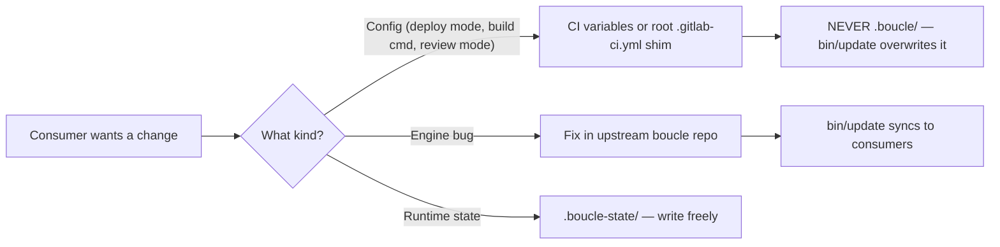

# AGENTS.md — Boucle agent guide

> **Maintenance** — This document captures mandatory principles. Lessons are in LESSONS.yml (machine-readable YAML, validated by bin/check-lessons). Anti-patterns
> and operating principles for agents. **Any new lesson discovered must be
> added here** to avoid repeating the same mistakes. See
> [CONTEXT.md](CONTEXT.md) for the project context and tech stack.

## Reference files (charter files)

Before working on any issue, agents MUST consult these files at the repo root:

- [AGENTS.md](AGENTS.md) — this document. Lessons (in LESSONS.yml) and conventions.
- [README.md](README.md) — project overview and getting started.
- [LOOP.md](LOOP.md) — per-consumer configuration (target repo, cadence, gates, caps).
- [CONTEXT.md](CONTEXT.md) — project context, tech stack, constraints.

**FORBIDDEN** to start any work without first reading [LOOP.md](LOOP.md)
and [CONTEXT.md](CONTEXT.md).

## Agent roles

| Agent   | Model                       | Steps | Temp | Role                                                                                                                |
| ------- | ---------------------------- | ----- | ---- | ------------------------------------------------------------------------------------------------------------------- |
| triage  | ollama-cloud/glm-5.2        | 200   | 0.3  | Analyzes issue, posts structured comment (TL;DR + Analysis + Acceptance criteria + Classification S/M/L + Questions + Disposition) |
| worker  | ollama-cloud/deepseek-v4-flash:0731 | 100   | —    | Implements on branch `boucle/<iid>`, reads `state.md`, uses codebase-memory-mcp, conventional commit                 |
| reviewer| ollama-cloud/deepseek-v4-flash:0731 | 35    | 0.2  | Adversarial review against preview URL, SHA-anchored verdict                                                       |
| e2e     | ollama-cloud/glm-5.2         | 30    | —    | Verifies on production URL, SHA-anchored verdict                                                                    |

See [LOOP.md](LOOP.md) for the pipeline and state machine details.

## MANDATORY operating principles

These principles are **NON-NEGOTIABLE**. Any agent that violates them introduces a
known recurring bug, documented in LESSONS.yml.

1. **Post-early rule** — The agent MUST post its comment or verdict **FIRST**, then
   refine it afterward. Step-limit waste (the agent exhausts its budget without ever
   posting) is bug #1. **Rule**: an incomplete draft posted is ALWAYS better than a
   refinement never posted.

2. **Silent-failure detection** — `bin/jc` exits with code `3` if the agent has
   produced no posted or drafted comment. CI then escalates to a human.
   An agent that produces nothing MUST be detected, **NEVER** ignored.

3. **Log-scraping fallback** — CI scrapes the agent stdout from `agent-output.log`.
   If the agent drafts a comment but exhausts its steps before posting, CI posts it
   on the agent's behalf. **The agent MUST therefore ALWAYS produce its output on
   stdout** (not only in memory, not only via tool calls).

4. **SHA-anchored verdict** — The reviewer/e2e verdict MUST include the SHA as
   **bare hex**: no quotes, no whitespace, no angle brackets.
   Exact format: `<!-- boucle:verdict v=1 role=reviewer sha=abc123def456 -->`.
   The CI parser **FAILS** if the format is not respected to the letter.

5. **Label idempotence** — GitLab records a *Resource Label Event* on every PUT,
   **even if the label is unchanged**. ALWAYS check whether the label is already
   present before writing it. A no-op write pollutes the history and may skew the
   state machine transitions.

6. **Anti-accumulation** — The `dispatch` EXIT trap fails if no `.boucle-issue` file
   is written. A webhook that produces no work MUST fail, **NEVER** silently consume
   a runner.

7. **Rebase before build** — Build dirties the working tree (`public/`).
   Rebase **REFUSES** a dirty tree. ALWAYS rebase **BEFORE** building,
   **NEVER** the reverse.

8. **Safety-net commit** — The agent may exhaust its steps before committing. CI
   stages+commits uncommitted changes automatically before rebase. The agent does
   **NOT** need to worry about committing perfectly — but it MUST avoid unstageable
   changes (binaries, local configs).

9. **Empty-MR guard** — The worker may produce zero changes (steps exhausted).
   CI detects `base_sha == head_sha` and re-triggers the worker or escalates.
   A worker MUST produce at least one commit (even trivial) to avoid this branch.

10. **Serial merge** — `resource_group: boucle-merge` serializes all merges.
    Each rebase is against a `master` that includes previously-merged MRs.
    **NEVER** parallelize merges.

11. **Doc self-maintenance** — Boucle maintains its own documentation as part
    of its loop. The triage identifies which charter docs an issue impacts,
    the worker updates them in the same MR as the code, the reviewer verifies
    conformance and completeness, the e2e verifies docs match production.
    Doc updates use Mermaid diagrams, explicit/imperative tone, and
    cross-references. **NEVER** let docs drift from code — a doc that
    describes a system that no longer exists is a bug.

## Lessons learned (forward-looking operating principles)

Each entry below is a **contract** that every agent and CI step MUST honor
going forward. The `❌ DO NOT / ✅ DO` pair is the rule; the incident that
produced it is not recorded here — it lives in git history. Numbers are
stable (a few are cross-referenced from `.gitlab-ci.yml`, `bin/jc` and
agent prompts); never renumber — a pruned entry leaves a gap, not a shift.

### What is NOT a lesson

A lesson prevents a **class** of mistakes from recurring. It is NOT:

- A bug report for an incident now fixed in code — the code fix prevents
  recurrence, not the doc.
- A change of mind or preference shift — that belongs in the relevant
  charter doc, not here.
- A one-off discovery ("directory X was missing from `SYNC_PATHS`") — if
  the fix is a one-line code change, the doc adds noise.

### Admission test (a new entry MUST pass all four)

1. **Class, not instance** — it describes a *class* of mistakes, not one
   incident. If it only makes sense with the incident's specifics (line
   numbers, variable names, SHAs), it is a bug report.
2. **Recurrence without the doc** — an agent or CI step would plausibly
   repeat this mistake *without* reading this doc. If the code fix alone
   prevents recurrence, do not add a lesson.
3. **Stable** — true regardless of current code state. No line numbers, no
   transient config values, no "until X" clauses.
4. **Not already covered** — not a restatement of an existing lesson or a
   charter-doc rule.

If an entry fails any test, fix the code and move on — do not add a
lesson. The worker MUST justify a new entry against this test (state the
justification on stdout); the reviewer MUST reject entries that fail it.

> Each lesson that states a *current protocol invariant* cross-references
> [SKILL.md](SKILL.md) §I<N> for the normative text. The lesson keeps the
> incident context (the ❌/✅ pair and the explanation) but defers the rule
> statement to SKILL.md to avoid dual-maintenance drift. Lessons that are
> pure incident catalogs (the bug is fixed in code) stay as-is.


The lessons are maintained in [LESSONS.yml](LESSONS.yml) — a machine-readable
YAML file where each lesson is a numbered entry with `title`, `❌` (DO NOT),
and `✅` (DO) keys. The YAML format enables automated validation
(`bin/check-lessons`) and duplicate detection in CI.

**How to read a lesson:**
- `title` — short label for the class of mistake.
- `❌` — the anti-pattern (one or more DO NOT entries).
- `✅` — the correct pattern (one or more DO entries).
- `pruned: true` — the lesson is obsolete (gap preserved, never renumber).
- `merged_into: N` — the lesson was merged into lesson #N (gap preserved).

**How to add a lesson** (worker → reviewer → CI gate):
1. The worker runs the four-point admission test above and states on stdout
   which tests the new lesson passes.
2. The worker adds the entry to LESSONS.yml with the next available number
   (or reuses a pruned/merged gap only if the class is identical).
3. The reviewer verifies the admission test passes and the format is correct.
4. `bin/check-lessons` (CI gate) validates: format (title + ❌ + ✅), no
   `Context:` narratives, no SHA/issue/line numbers, sequential numbering,
   cross-references valid, and flags potential duplicates by keyword overlap.

**Never renumber** — a pruned or merged entry leaves a gap, not a shift.
Cross-references from `.gitlab-ci.yml`, `bin/jc`, and agent prompts use
stable lesson numbers.

## Documentation self-maintenance

Boucle self-maintains its own documentation as part of the autonomous loop.
Documentation is **code**: a doc that drifts from the system it describes is a
bug. The four agents share the responsibility of keeping the charter docs
(`AGENTS.md`, `CONTEXT.md`, `LOOP.md`, `README.md`) in sync
with reality.

### Distributed workflow

- **Triage** — Adds a `Docs impact: <docs>` line to the `Analysis` section of
  the structured comment, listing which charter docs the issue touches
  (e.g. `Docs impact: AGENTS.md, LOOP.md`).
- **Worker** — Reads the impacted charter docs **before** implementing. Conforms
  to them. If the change requires updating a doc (new state, new variable, new
  agent responsibility, new seam), the worker updates the doc **in the same
  MR** as the code change. When discovering a new bug or anti-pattern, the
  worker adds a lesson entry to `LESSONS.yml`.
- **Reviewer** — Verifies two things: (1) the worker respected the charter docs
  during implementation (doc conformance), and (2) the worker updated the docs
  when required (doc completeness). On `FAIL`, the reviewer may require the
  worker to add a `LESSONS.yml` entry to capture the regression.
- **E2E** — Verifies that charter docs match production reality: after
  deployment, the e2e agent confirms that the documented pipeline, agent
  responsibilities, and seams still hold.

### Doc rules

- Use **Mermaid syntax** (` ```mermaid ` fenced blocks) for all diagrams.
- Use **explicit/imperative tone** ("MUST", "NEVER", "ALWAYS") — not descriptive
  prose.
- Keep docs **up to date with the code** — never let a doc describe a system
  that no longer exists.
- **Cross-reference** related docs with relative markdown links
  (e.g. `[AGENTS.md](AGENTS.md)`).

See [AGENTS.md](AGENTS.md) section "Documentation
self-maintenance" for the pipeline diagram and the per-agent responsibilities.

<!-- codebase-memory-mcp:start -->
## Codebase Knowledge Graph (codebase-memory-mcp)

This project uses `codebase-memory-mcp` to maintain a knowledge graph of the codebase.
**ALWAYS** prefer MCP graph tools over `grep`/`glob`/`file-search` for code discovery.

The graph is built once (by CI or locally) and auto-syncs on changes. If
`search_graph` returns nothing, run `index_repository` with the repo path, then
retry.

### Priority order

1. `search_graph` — find functions, classes, routes, variables by pattern
2. `trace_path` — trace who calls a function or what it calls
3. `get_code_snippet` — read specific function/class source code
4. `query_graph` — run Cypher queries for complex patterns
5. `get_architecture` — high-level project summary

### When to fall back to grep/glob

- Searching for string literals, error messages, config values
- Searching non-code files (Dockerfiles, shell scripts, configs)
- When MCP tools return insufficient results

### Examples

- Find a handler: `search_graph(name_pattern=".*OrderHandler.*")`
- Who calls it: `trace_path(function_name="OrderHandler", direction="inbound")`
- Read source: `get_code_snippet(qualified_name="pkg/orders.OrderHandler")`
- Architecture overview: `get_architecture(aspects=["all"])`
<!-- codebase-memory-mcp:end -->

## Commit conventions

**ALWAYS** commit changes before finishing. Uncommitted edits are **NOT** durable —
they can be lost if the working tree is reset, checked out, or if the session ends.

### Format

- Mandatory format: `feat: <description> (#<iid>) [skip ci]`
- Conventional commits: `feat:`, `fix:`, `docs:`, `chore:`, `refactor:`, `test:`
- **NEVER** rebase, merge, push or deploy from the worker — CI handles that.
- **ALWAYS** verify `git log --oneline -1` and `git status` (clean working tree)
  after each commit.

### Procedure

1. Stage modified files: `git add <paths>` (be specific, **NEVER** `git add -A`
   unless `git status` is verified clean).
2. Commit with a concise conventional-commit message.
3. Verify the commit landed: `git log --oneline -1` and `git status`.

**NEVER** push unless explicitly requested. **NEVER** amend or force-push unless
explicitly requested. If a commit fails (pre-commit hook rejected), fix the issue
and create a **NEW** commit — **NEVER** amend the failed commit.

## Upstream fix workflow

The upstream-first workflow is defined in
[`.jcode/UPSTREAM-FIX-WORKFLOW.md`](.jcode/UPSTREAM-FIX-WORKFLOW.md).

That file is **portable**: it ships with boucle when installed in consumer projects
(via the `.jcode/` directory).
### Golden rule

**Fix upstream in boucle FIRST, then update boucle in the consumer, THEN remediate
existing data.** Mandatory order:

1. Fix the bug in the boucle upstream repo.
2. Update the boucle installation in the consumer project.
3. Remediate existing data impacted by the bug.

### FORBIDDEN

- **NEVER** patch a consumer to work around a boucle defect.
- **NEVER** introduce a local workaround that won't be reported upstream.
- **NEVER** mask a boucle bug with a consumer config.

A bug on a consumer project MUST be traced to its root cause in boucle and fixed
there first.

## `.boucle/` ownership — what agents can and cannot modify

`.boucle/` is the **engine directory**, 100% owned by `bin/update`. Agents
MUST NOT modify files under `.boucle/` directly. The CI guard
`bin/check-boucle-sync` rejects any commit touching `.boucle/` that is not a bot
`chore(boucle):` commit (produced by `bin/update`). A manual edit to `.boucle/`
is a bug: `bin/update` will overwrite it on the next sync, silently discarding
the change.

`.boucle-state/` is **runtime state** (gitignored) — agents write there freely
(`state.md`, `iterations.md`, etc.). It is never committed and never synced.

To change **consumer config** (deploy mode, build command, review mode, ...):
use **CI variables** (Settings → CI/CD → Variables) or the **root
`.gitlab-ci.yml` shim** — NEVER `.boucle/.gitlab-ci.yml`.

To fix an **engine bug**: fix it in the **upstream boucle repo**
(`ankaboot-source/boucle`), then `bin/update` syncs it to consumers.



See [LOOP.md](LOOP.md) for the per-consumer configuration seams.

## See also

- [CONTEXT.md](CONTEXT.md) — Project context, tech stack, constraints
- [README.md](README.md) — Overview, getting started, usage
- [LOOP.md](LOOP.md) — Per-consumer configuration
- [.jcode/UPSTREAM-FIX-WORKFLOW.md](.jcode/UPSTREAM-FIX-WORKFLOW.md) — Upstream fix workflow
