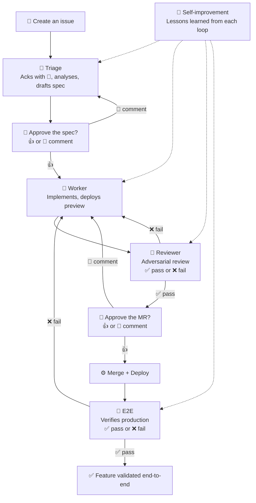
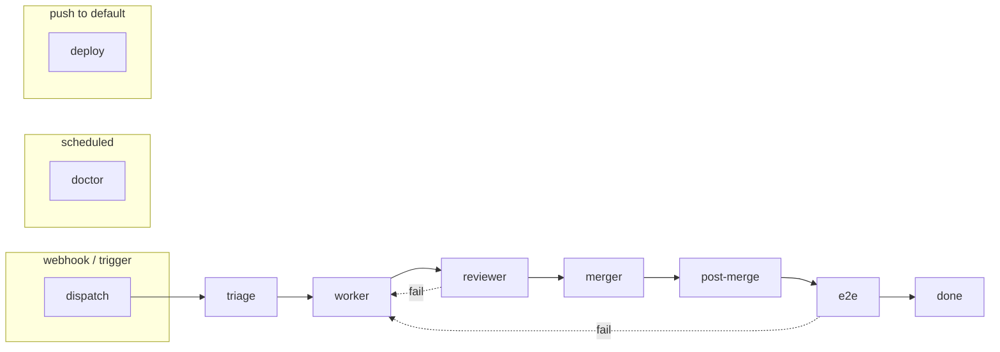
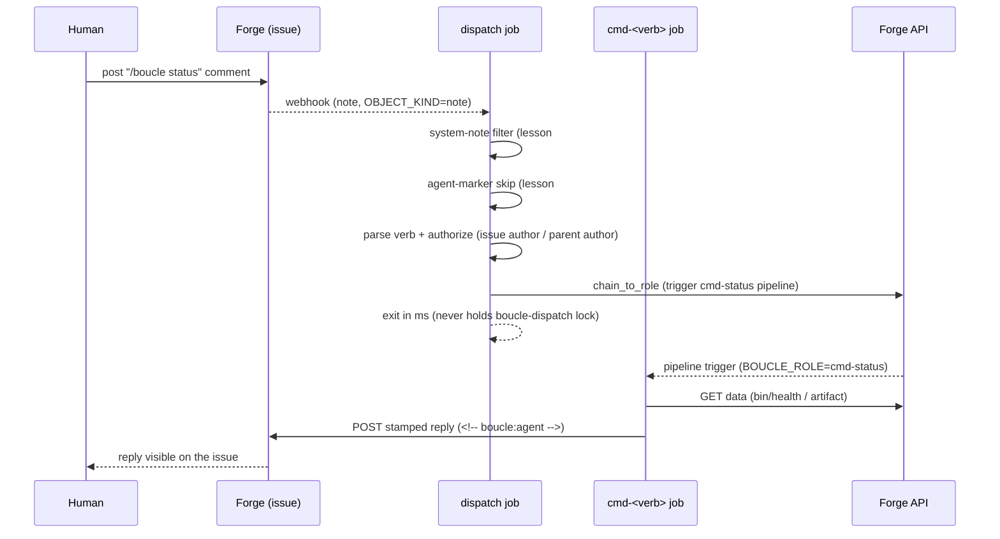

# ARCHITECTURE.md — Boucle engine

> Implementation map of the boucle **engine** — the portable dev-loop that
> turns a forge issue into a reviewed, merged, deployed feature. This is the
> *how*: code structure, forge adapters, CI stages, agent runtime. The *what*
> (protocol: invariants, state machine, markers, handoff) lives in
> [SKILL.md](SKILL.md); the *why* (identity, constraints) in
> [CONTEXT.md](CONTEXT.md); the *entry* in [README.md](README.md).
>
> Maintained by the autonomous loop (see [AGENTS.md](AGENTS.md) §
> "Documentation self-maintenance").

## 1. Overview

Boucle is a **portable, forge-agnostic dev-loop engine**. It is installed into
a consumer repo (as a submodule or vendored copy) and drives a fixed pipeline
of agent roles — triage, worker, reviewer, e2e — over the forge's native
primitives (issues, labels, MRs, approvals, webhooks). The loop is **async by
design** (I3): it runs on CI, and the human intervenes at two named gates —
spec approval and MR review — rather than in a live chat.

The engine is split from the consumer site it once described (the
urgence-palestine.fr Astro site was extracted; see [CONTEXT.md](CONTEXT.md) §1).
This document describes the engine itself.

### The 8-stage pipeline



The loop runs asynchronously on CI. The `doctor` job (a scheduled
self-healing sweep) runs automatically — there is nothing to run by hand.

## 2. Code structure

```
.
├── .gitlab-ci.yml            # GitLab pipeline (12 jobs, thin wrappers)
├── .github/workflows/boucle.yml  # GitHub Actions equivalent
├── .jcode/                   # Agent runtime config (prompts, skills, workflow)
│   ├── agents/               # 4 role prompts: triage.md, worker.md, reviewer.md, e2e.md
│   ├── skills/               # ~60 vendored skills + boucle/SKILL.md (the protocol)
│   └── UPSTREAM-FIX-WORKFLOW.md  # upstream-first bug-fix constraint
├── bin/                      # CLI scripts (the engine's executable surface)
│   ├── jc                    # harness entrypoint: wraps jcode, scrubs, caps, runs
│   ├── setup                 # consumer install: CI vars, labels, board, webhook
│   ├── update                # self-update: sync SYNC_PATHS from upstream
│   ├── doctor                # read-only board audit (bin/doctor --audit)
│   ├── check-doc-sync        # lint: labels + markers code ↔ SKILL.md
│   ├── forge/                # forge abstraction layer
│   │   ├── common.sh         # shared contract + marker stamping
│   │   ├── gitlab.sh         # glab CLI wrapper
│   │   └── github.sh         # gh CLI wrapper
│   ├── lib/depends-on.sh     # sub-issue dependency gate
│   ├── collapse-duplicate-notes  # dedupe repeated bot notes
│   ├── describe-images       # vision-model image descriptions (text for agents; covers attachments + PR-changed repo images)
│   ├── fetch-issue-attachments   # mine /uploads/ from issue + parent notes
│   ├── fetch-mr-attachments      # mine /uploads/ from MR notes
│   ├── forge-note            # marker-stamped note helper
│   ├── health                # read-only per-issue loop-health summary
│   └── render-preview        # preview URL rendering
├── lib/                      # shared shell libraries
│   ├── boucle.sh             # set_boucle_label, chain_to_role, resolve_reporter_id, ...
│   ├── boucle-ci.sh          # shared CI stage bootstrap (sources forge + boucle.sh)
│   └── boucle-ci/            # 11 stage scripts (forge-agnostic job logic)
│       ├── dispatch.sh  triage.sh  worker.sh  reviewer.sh
│       ├── merger.sh    catchup.sh post-merge.sh deploy.sh
│       ├── doctor.sh    e2e.sh     check.sh
├── docker/Dockerfile.agents  # jcode + codebase-memory-mcp baked image
├── docs/superpowers/         # design plans + specs (self-update, merge-catchup, ...)
└── SKILL.md                  # symlink → .jcode/skills/boucle/SKILL.md (the protocol)
```

| Path | Role | Key files |
|------|------|-----------|
| `bin/` | Executable surface: install, update, harness, forge adapters, helpers | `jc`, `setup`, `update`, `forge/*.sh` |
| `lib/` | Shared shell libraries: state machine, CI stage logic | `boucle.sh`, `boucle-ci.sh`, `boucle-ci/*.sh` |
| `.jcode/` | Agent runtime config: role prompts, vendored skills, protocol | `agents/*.md`, `skills/boucle/SKILL.md` |
| `.gitlab-ci.yml` | GitLab pipeline definition (thin wrappers over `lib/boucle-ci/*.sh`) | 12 jobs |
| `.github/workflows/boucle.yml` | GitHub Actions equivalent | same stage functions |
| `docker/` | Pre-baked agent image (jcode + codebase-memory-mcp) | `Dockerfile.agents` |

## 3. Forge abstraction layer

The engine speaks to the forge through a thin seam: `bin/forge/common.sh`
defines the **contract**, and `bin/forge/{gitlab,github}.sh` implement it.
`lib/boucle.sh` and `bin/jc` source `common.sh` and call `forge_*` functions
without knowing which forge is active. The active forge is selected by
`BOUCLE_FORGE` (default `gitlab`); `forge_init()` sources the matching backend.

**Contract conventions** (`bin/forge/common.sh`):
- All functions are best-effort (`set +e`, `2>/dev/null`, `|| true`) so
  transient API errors never kill the loop.
- No function references `glab`, `gh`, `curl`, or forge-specific CLI directly —
  that is the backend's job.
- Project identity is passed via `BOUCLE_PROJECT_ID` / `BOUCLE_PROJECT_PATH`
  (set by the CI wrapper), never read from `CI_*` / `GITHUB_*` directly.

**Marker stamping is mandatory** (I7). Every comment posted via
`forge_issue_note` / `forge_mr_note` carries the invisible
`<!-- boucle:agent -->` marker (`stamp_agent_marker`). Dispatch uses
`has_agent_marker` to recognise boucle's own writes **without asking who the
actor was** — which is what makes mono-user mode possible (one account owns
both the issues and the loop). See [AGENTS.md](AGENTS.md) lesson #55.

| Primitive | Effect |
|---|---|
| `forge_issue_note <iid> <msg>` | post a comment on an issue (stamped) |
| `forge_mr_note <mr_iid> <msg>` | post a comment on an MR (stamped) |
| `forge_issue_labels_get <iid>` | read current labels (comma-separated) |
| `forge_issue_labels_set <iid> <labels>` | write labels (replaces boucle: set, preserves non-boucle) |
| `forge_issue_assign <iid> <user_id>` | assign the issue |
| `forge_mr_diff <mr_iid>` | fetch MR diff |
| `forge_mr_approvals <mr_iid>` | check native approval state |
| `forge_mr_check_suites <mr_iid>` | fetch CI check suites |
| `forge_trigger_role <iid> <role> [vars]` | trigger a role pipeline |

The same loop runs on both forges: GitLab is the reference implementation
(`glab` CLI), GitHub is functional but less battle-tested
([CONTEXT.md](CONTEXT.md) §8). The full primitive table is in
[SKILL.md](SKILL.md) §5.

## 4. CI pipeline

The pipeline is defined in `.gitlab-ci.yml` (12 jobs) and mirrored in
`.github/workflows/boucle.yml`. Each job is a **thin wrapper** that sources
`lib/boucle-ci.sh` (which sources the forge backend + `lib/boucle.sh`) and
calls the corresponding `boucle_ci_<stage>` function from `lib/boucle-ci/`.
The extracted functions are forge-agnostic and shared by both CI files.



| Stage | Trigger (`BOUCLE_ROLE` gating) | `resource_group` | What it does | Script |
|---|---|---|---|---|
| `check` | push / MR to default branch | — | shellcheck, shfmt, bats, doc-sync lint | `lib/boucle-ci/check.sh` |
| `dispatch` | webhook (no `BOUCLE_ROLE`) | `boucle-dispatch` | webhook router: parse payload, route to role | `lib/boucle-ci/dispatch.sh` |
| `triage` | webhook (no `BOUCLE_ROLE`) | — (no `BOUCLE_ISSUE` at eval) | analyse issue, draft spec | `lib/boucle-ci/triage.sh` |
| `worker` | trigger `BOUCLE_ROLE=worker` | `boucle-issue-$BOUCLE_ISSUE` | implement on `boucle/<iid>-<slug>`, deploy preview | `lib/boucle-ci/worker.sh` |
| `reviewer` | trigger `BOUCLE_ROLE=reviewer` | `boucle-issue-$BOUCLE_ISSUE` | adversarial review of MR diff / preview | `lib/boucle-ci/reviewer.sh` |
| `merger` | trigger `BOUCLE_ROLE=merger` | `boucle-merge` (serial) | rebase + merge after approval | `lib/boucle-ci/merger.sh` |
| `post-merge` | trigger `BOUCLE_ROLE=post-merge` (from merger, catchup, or doctor) | — | deploy-wait + e2e trigger | `lib/boucle-ci/post-merge.sh` |
| `catchup` | trigger `BOUCLE_ROLE=catchup` | — | direct-merge recovery: audit note + chain to post-merge | `lib/boucle-ci/catchup.sh` |
| `deploy` | push to default branch | — | build + deploy (Cloudflare Pages / GitLab Pages) | `lib/boucle-ci/deploy.sh` |
| `e2e` | trigger `BOUCLE_ROLE=e2e` | `boucle-issue-$BOUCLE_ISSUE` | verify production URL, SHA-anchored verdict | `lib/boucle-ci/e2e.sh` |
| `doctor` | schedule (every 10 min) | — | self-healing board sweep | `lib/boucle-ci/doctor.sh` |
| `pages` | push to default branch | — | GitLab Pages publish | inline |

**Role chaining.** Stages are chained via `chain_to_role` →
`forge_trigger_role`, which triggers a new pipeline with `BOUCLE_ISSUE` +
`BOUCLE_ROLE` variables. The `resource_group` serializes per-issue work
(`boucle-issue-$BOUCLE_ISSUE`) and all merges (`boucle-merge`, I10). The
`dispatch` job writes the issue IID to `.boucle-issue` for the downstream
`triage` job (`needs: [dispatch]`, optional); its EXIT trap fails if no work
was produced (anti-accumulation, lesson #6).

**Serial merge.** The merger rebases the MR onto the default branch serially
(`resource_group: boucle-merge`), so each rebase is against a `master` that
includes previously-merged MRs. On rebase conflict it escalates to the human
via `boucle_escalate_merge_conflict` (lib/boucle.sh) rather than blind-retrying
(lesson #22, #51). It handles "Pipelines must succeed" via
merge-when-pipeline-succeeds (MWPS, lesson #42).

## 5. Agent runtime (jcode)

`bin/jc` is the harness entrypoint (S3): it wraps jcode, scrubs secrets,
enforces caps, runs the agent, and asserts side effects. Swapping to another
coding agent = editing this one file.

**Invocation** (`bin/jc:1160`):

```bash
jcode --provider-profile "$BOUCLE_PROVIDER_PROFILE" --model "$MODEL" --tools '*' \
  --no-update --no-selfdev run --quiet "$PROMPT" > "$AGENT_LOG" 2>&1
```

- **Ephemeral sessions.** jcode has no SQLite DB — run mode is ephemeral, so
  no DB isolation is needed. Each iteration is a fresh CI job and a fresh agent
  process; no conversation is carried.
- **MCP strip.** jcode has MCP support but it is disabled in CI via
  `JCODE_RUN_MCP=0` (the handshake hangs within 30s, lesson #3). Agents fall
  back to native `glob`/`grep`/`read` and the `codebase-memory-mcp cli`
  fallback (lesson #23).
- **Provider probe** (`bin/jc:1131`). Before the run, `probe_cached` checks the
  primary provider. If it is down and a fallback is configured, it switches
  pre-emptively; if both are down it exits 4 (provider-down contract) rather
  than burning a runner (lesson #29, #30, #32).
- **Fallback (exit-4 path).** When `BOUCLE_FALLBACK_PROVIDER` is set, each
  jcode invocation is wrapped in `timeout` and retried with the fallback
  provider/model on the exit-4 condition. The fallback block only executes
  because the primary is killed by the timeout (lesson #30).
- **Cost accounting.** `bin/jc` emits a structured `[boucle:metrics]` line
  (role, agent, iteration, wall_clock, peak_rss) and records cost to
  `.boucle/<issue>/cost.json` from `BOUCLE_PRICING_JSON`. `bin/health` reads
  `health.jsonl` + `cost.json` for a per-issue loop-health summary.
- **Loop-health measurement.** An RSS sampler polls `/proc` VmRSS for jcode
  processes to diagnose runner memory bottlenecks.
- **Agent transcript.** Agent stdout+stderr go to `$AGENT_LOG`
  (agent-output.log) for the CI log-scraping fallback, then are echoed to the
  job log. Secrets are scrubbed before invocation.

**Role prompts** (`.jcode/agents/*.md`) carry YAML frontmatter (model,
reasoning_effort, steps). `bin/jc` extracts the model from the frontmatter and
builds the user prompt from the issue body, notes, reviewer feedback, and
attachments (with token-cost trimming). The prompts are **engine-owned**:
`bin/jc` reads the engine's copy (its own directory, then `$BOUCLE_HOME`)
before any copy in the consumer's workspace, and warns when the two differ.
On a submodule install the workspace copy is frozen — `bin/update` can only
move the submodule pointer — so a workspace-first lookup would run last
month's prompt against this month's parser.

## 6. State machine implementation

The protocol's state machine (labels + transitions) is specified in
[SKILL.md](SKILL.md) §2. The engine implements it in `lib/boucle.sh`.

**`set_boucle_label <iid> <detail> <gross>`** (`lib/boucle.sh:626`) is the
single write path for state transitions. It:
1. Reads current labels, preserves non-`boucle:` labels.
2. Writes the detail axis (`boucle:todo`, `boucle:working`, ...) and, in
   multi-user mode, the gross axis (`boucle::status::bot` / `::human`). In
   mono-user mode it writes the detail axis alone.
3. **Notifies on the transition, never on the state** — it checks whether the
   label was already present before calling `boucle_notify`, so the doctor
   sweep re-applying an unchanged label does not re-fire the channel (lesson
   #5, #50).
4. **Reassigns** — on `boucle::status::bot` it assigns the issue to the bot
   (`BOUCLE_BOT_ID`); on `::human` it reassigns to the human reporter via
   `resolve_reporter_id` (which walks the parent chain to skip bot-authored
   sub-issues). Both are no-ops in mono-user mode.

**`chain_to_role <iid> <role> [vars]`** → `forge_trigger_role` triggers the
next role's pipeline with `BOUCLE_ISSUE` + `BOUCLE_ROLE` variables. This is
how the loop advances: worker → reviewer → merger → e2e, and how it re-queues
on FAIL (reviewer → worker, e2e → worker).

**`resolve_reporter_id`** walks up the parent-issue chain (max depth 10) to
find the original human reporter, skipping bot-authored sub-issues and
following E2E-fail origin markers.

## 7. Doctor

`lib/boucle-ci/doctor.sh` (`boucle_ci_doctor`) is the scheduled self-healing
sweep (every 10 min). It:

- **Board maintenance.** Detects orphaned triages, stuck `boucle:triage`
  issues, orphaned `boucle:needs-info` / `boucle:spec-review` issues, and
  re-triggers the appropriate role.
- **Staleness recovery.** Re-triggers stuck worker/reviewer pipelines past
  `BOUCLE_STALENESS_THRESHOLD`, guarded by `issue_has_active_pipeline` (which
  matches pipelines to the issue via the `BOUCLE_ISSUE` variable — not the
  unreliable `updated_at` proxy, lesson #33) and a per-issue dedup timestamp
  (`doctor-triggers/<iid>`).
- **Adaptive sweep (fingerprint).** A cheap MONITOR pass fingerprints the
  board; when nothing has moved since the last pass it skips the full sweep.
  A backstop (`BOUCLE_DOCTOR_BACKSTOP`) forces a full sweep regardless, so a
  stale fingerprint cannot strand the board.
- **Backstop.** The active-pipeline check is primary; the dedup timestamp is
  a secondary backstop for pipelines still in `created`/`waiting_for_resource`.
- **Closed-issue recovery.** The doctor scans `state=closed` issues with
  `boucle:working` / `boucle:review` labels and recovers them (closing zombie
  MRs, setting `boucle:done`) — the safety net for missed closed-issue guards
  (lesson #44).
- **File-impact gate (planned).** A `git merge-tree` safety-net gate defers
  parallel workers on file overlap (design spec
  `docs/superpowers/specs/2026-08-12-file-impact-gate-design.md`).

## 8. Self-update

`bin/update` keeps a consumer's engine in sync with upstream boucle. It:

- **SYNC_PATHS** — the set of engine files copied from upstream
  (`bin lib .pi .gitlab-ci.yml|.github/workflows/boucle.yml .jcode/agents
  .jcode/skills .jcode/UPSTREAM-FIX-WORKFLOW.md`), forge-conditional on the
  active forge.
- **`BOUCLE_VERSION` forge Variable** — records the current upstream version
  (tag in release mode, HEAD SHA in dev mode). `bin/update` reads it to know
  the current version and writes it back after a successful sync. For
  submodule installs, the submodule pointer (`git submodule status .boucle`)
  is the fallback — it is always accurate. There is no `.boucle-version`
  file; boucle only runs in forge CI, so the forge Variable is always
  available when it matters.
- **Modes** — `release` (latest tag) or `dev` (HEAD of `main`), selected by
  `BOUCLE_UPDATE_MODE`.
- **Fail-open** — `bin/update` has no `-e`; commands fail individually without
  aborting. If the upstream fetch fails, the consumer stays on its current
  version and the pipeline continues (lesson #18: boucle is not yet public, so
  `bin/update` 401s on a private repo and fixes propagate manually).
- **Default-branch gate** — the self-update runs ONLY on the default branch
  (`CI_COMMIT_BRANCH == CI_DEFAULT_BRANCH`). On a worker branch
  (`boucle/<iid>-<slug>`) the self-update is skipped — otherwise its
  `chore(boucle):` commits pollute the worker's MR with engine-sync work
  that is not the issue's work (lesson #67). The existing
  `BOUCLE_PIPELINE_SOURCE != "push"` guard prevents the feedback loop
  (push → pipeline → bin/update → push); the branch gate prevents
  branch pollution.

See [LOOP-README.md](LOOP-README.md) for the install/update flow.

## 9. Mono-user mode

Boucle supports two deployment models:

| Model | Bot account | Trigger | Anti-loop guard |
|---|---|---|---|
| **Multi-user** (default) | separate bot account (`up-bot`) | actor ≠ bot username | actor-based + marker |
| **Mono-user** (`--mono-user`) | the human's own account | actor check is useless (one actor) | marker-only (`<!-- boucle:agent -->`) |

In **mono-user mode** (`BOUCLE_MONO_USER=true`, set by `bin/setup --mono-user`),
a single forge account owns both the issues and the loop. There is no separate
bot identity. This is the fallback when the forge does not allow a second
account or the human does not want to provision one.

### What changes in mono-user mode

- **Anti-loop guard** — the actor-based guard (`ACTOR != BOUCLE_BOT_USERNAME`)
  is useless when one account owns both sides: it would discard the human's
  own triggers. Dispatch falls back to the `<!-- boucle:agent -->` marker
  (lesson #55): every comment posted via `forge_issue_note` /
  `forge_mr_note` carries the invisible marker; dispatch skips comments
  that carry it, regardless of who the actor is.
- **Gross label axis** — `boucle::status::bot` / `boucle::status::human` are
  not written (the "whose side is this on?" question has no answer when
  there is one actor). `set_boucle_label` writes the detail axis alone.
- **Assignee side effects** — both reassignments (to bot, to human) are
  no-ops: the issue already belongs to the only human, and forges emit
  nothing when the assignee set does not change.
- **Git identity** — `BOUCLE_BOT_EMAIL` / `BOUCLE_BOT_USERNAME` default to
  `boucle-bot@boucle.local` / `up-bot` (generic, never identifies a
  consumer). In mono-user mode the consumer MAY override them to match
  the single account's identity, but the defaults are safe — they never
  leak a consumer name into commits (lesson #66).

### What does NOT change

- The state machine, the role pipeline, the reviewer/e2e verdict format,
  the marker protocol, the doctor sweep — all run identically.
- `BOUCLE_BOT_USERNAME` still defaults to `up-bot` (used for git config,
  remote URL, and the actor guard in multi-user mode).
- `BOUCLE_BOT_ID` is resolved by username via the forge users API in the
  `default` before_script when unset (lesson #50) — in mono-user mode this
  resolves to the human's own user ID, which is correct (the human IS the
  bot).

See [README.md](README.md) §"Running without a bot account" for setup, and
[LOOP.md](LOOP.md) for the `BOUCLE_MONO_USER` variable reference.

## 10. Retry strategy

The worker's branch handling is governed by `BOUCLE_RETRY_STRATEGY`
(`lib/boucle-ci/worker.sh:64`):

| Strategy | Behavior |
|---|---|
| `preserve` | never destroys work — rebase onto default branch |
| `reset` | always reset to `origin/$BOUCLE_DEFAULT_BRANCH` |
| `adaptive` (default) | reset only if the previous iteration shipped no changes |

- **Worktree handling.** The worker checks out `boucle/<iid>-<slug>` (the
  name `boucle_branch_name` computes — legacy bare `boucle/<iid>` when the
  issue title is unavailable). If the branch has prior worker commits, it
  rebases onto the default branch to preserve work (lesson #22, #51). On
  rebase conflict it aborts and preserves the branch — never a destructive
  reset that orphans pushed commits.
- **Discarded-head tagging.** When a reset is warranted (adaptive + previous
  no-changes), the discarded head is never lost silently: it is tagged
  `boucle/<iid>/discarded-<timestamp>` and named in an issue comment.
- **Safety-net commit.** If the agent exhausts its steps before committing, CI
  stages+commits uncommitted changes automatically before rebase (lesson #8,
  #14). The worker must avoid unstageable changes (binaries, local configs).

## 11. Known limitations

The engine's known limitations are catalogued in [CONTEXT.md](CONTEXT.md) §8.
The most architecturally relevant:

- **MCP hang in CI** — the codebase-memory-mcp handshake can exceed the 30s
  runner window; `bin/jc` disables MCP via `JCODE_RUN_MCP=0` (lesson #3).
- **Steps exhausted before commit** — the worker can run out of steps before
  committing; CI applies a safety-net commit before rebase (lesson #8).
- **No-op label writes** — the forge records a Resource Label Event on every
  PUT; all label code checks current state before writing (lesson #5).
- **Empty MR guard** — if the worker produces zero changes, CI detects
  `base_sha == head_sha` and re-triggers or escalates (lesson #9, #15).
- **Webhook without work** — a webhook that produces no `.boucle-issue` file
  must never consume a runner silently; the `dispatch` EXIT trap fails the job
  (lesson #6).

## 12. The `/boucle` interactive command

The `/boucle` command is a **forge-native observability surface**: a human
types `/boucle <verb>` as an issue comment, and a separate fast CI job fetches
data and posts a stamped reply comment. It is read-only at MVP — **no agent
invocation, no label writes, no security surface**. It closes the one gap
labels cannot carry: the *content* of an agent run (`agent-output.log`) and
the *detail* of loop health (`bin/health`), in the same channel the loop
already posts in ([CONTEXT.md](CONTEXT.md) §7).

### 12.1 Non-redundancy principle

Labels are the single plan of control/state. `/boucle` is what labels cannot
carry: **instruction text + observability**. The two MUST NEVER overlap:

> **Labels = control/state. `/boucle` = what labels cannot carry: instruction text + observability.**

Control words that reimplement `set_boucle_label` (`retry`/`cancel`/`pause`/
`resume`) are **cut** — a `/boucle retry` that sets `boucle:todo` is a
redundant second plan of control that will drift from the label one. `/boucle`
NEVER writes a label (idempotence, lesson #4, is trivially satisfied — there
is nothing to write).

### 12.2 Trigger syntax

Two equivalent forms, one parser, case-insensitive, anchored at the first
non-empty line of the comment body:

```
^/boucle <verb> <args>        OR        ^@<BOUCLE_BOT_USERNAME> <verb> <args>
```

`BOUCLE_BOT_USERNAME` is resolved by the fallback in [AGENTS.md](AGENTS.md)
lesson #50 (default `up-bot`). **Issue scope only at MVP** — MR comments are
disabled (MR feedback already flows through the existing channel). Phase 2 may
open a minimal MR subset.

### 12.3 Verb table

| Verb | Action | Backing | Status |
|---|---|---|---|
| `/boucle log [role]` | Fetch the `agent-output.log` artifact of the most recent run of `<role>` (default: the role in flight, else the last completed); post the tail (≤ comment-size limit) as a stamped comment. | GitLab: `GET /projects/:id/jobs/:job_id/artifacts/*artifact_path`. GitHub: list artifacts → `GET .../artifacts/{id}/zip` (post-completion only). | **MVP** |
| `/boucle status` | Post a projection of `bin/health <issue>` (iterations, outcomes by role, cost total, last verdict SHA, role in flight). | `bin/health` (LOOP.md §"Loop-health measurement"). | **MVP** |
| `/boucle help` | Post the list of supported verbs + the non-redundancy rationale. | Static text. | **MVP** |
| `/boucle jc <instruction>` | Full-capability "manual worker" (maintainer-only, produces a commit/MR). | — | **Deferred (phase 2)** |
| `/boucle tail [role]` | Live log. | GitLab `GET /jobs/:id/trace` (fetch-and-diff + edit note). **GitHub has no streaming log API** — impossible via API. | **Deferred (phase 2, GitLab-only)** |
| `/boucle cancel` | Kill a running pipeline mid-flight. | Native forge API (`POST /pipelines/:pid/cancel` / `POST /actions/runs/:id/cancel`). | **Deferred (phase 2)** |

Unknown first token → **no action**: post a one-line "unknown verb, try
`/boucle help`" reply. The MVP does NOT fall through to `jc`.

### 12.4 Insertion point

The parser lives in the `dispatch` note handler, **after the system-note
filter** (dispatch.sh:317-323), gated on `OBJECT_KIND == "note"`. This is the
correction of an earlier design that placed the parser before the actor-identity
skip — which would have processed system notes before the filter (violates
lesson #34). After the filter, only genuine human notes reach the parser. The
agent-marker skip (dispatch.sh:99-103) already ran upstream, so the bot's own
stamped replies (which carry `<!-- boucle:agent -->`) are skipped — no
self-trigger loop (lesson #55).

### 12.5 Separate jobs (not inline dispatch work)

`log`/`status`/`help` run as **separate fast jobs**, not inline in the dispatch
job. The dispatch job holds `resource_group: boucle-dispatch` (a static name
serializing all dispatches globally); an inline artifact fetch + comment post
would hold that lock for seconds and queue every other webhook behind it
(lesson #101). Each verb gets its own job with
`resource_group: boucle-cmd-$BOUCLE_ISSUE`, triggered via
`chain_to_role "$IID" "<verb>"` (the existing chaining primitive,
lib/boucle.sh:1030). The dispatch job parses + authorizes + chains, then exits
in milliseconds.

| Job | `BOUCLE_ROLE` | Script | Backing |
|---|---|---|---|
| `cmd-log` | `cmd-log` | `lib/boucle-ci/cmd-log.sh` | `forge_job_artifact` (bin/forge/{gitlab,github}.sh) |
| `cmd-status` | `cmd-status` | `lib/boucle-ci/cmd-status.sh` | `bin/health <issue>` |
| `cmd-help` | `cmd-help` | `lib/boucle-ci/cmd-help.sh` | static text |

### 12.6 Authorization

- **`log` / `status` / `help`**: actor ∈ {issue author, parent-issue human
  author via `resolve_reporter_id` (one generation, lesson #17)}. These are
  observability of data the actor could already see in the CI UI — no new
  trust boundary crossed. System notes filtered (lesson #34).
- **No `BOUCLE_COMMAND_ENABLED` master switch needed at MVP** — there is no
  agent invocation and no secret exfiltration surface (no `bash`, no `write`,
  no agent at all). The switch becomes necessary in phase 2 when `jc` lands.
- **Closed-issue guard** (lesson #44): do not run commands on a closed issue
  (except `help`, which is pure text).
- **Fail-open on API error**: the data is observable in the CI UI — no new
  trust boundary.

### 12.7 Sequence diagram



### 12.8 Cross-references

- [LOOP.md](LOOP.md) §"Interactive commands" — CI variables (`BOUCLE_COMMAND_*`
  family, future `BOUCLE_COMMAND_ENABLED` switch).
- [AGENTS.md](AGENTS.md) — lessons #100 (marker+authz), #101 (dispatch lock).
- [CONTEXT.md](CONTEXT.md) §7 — forge-native constraint (no new frontend, no
  server, no computer to keep running).
- [SKILL.md](SKILL.md) §8 — the interactive-mode harness commands (local
  `bin/boucle`), distinct from the forge-native `/boucle` command.

## See also

- [SKILL.md](SKILL.md) — the protocol (invariants, state machine, markers, handoff)
- [AGENTS.md](AGENTS.md) — contribution conventions + lessons learned (incident catalog)
- [CONTEXT.md](CONTEXT.md) — identity, audience, philosophy, constraints
- [LOOP.md](LOOP.md) — per-consumer configuration
- [README.md](README.md) — overview, getting started
- [LOOP-README.md](LOOP-README.md) — install / self-update flow
- [.jcode/UPSTREAM-FIX-WORKFLOW.md](.jcode/UPSTREAM-FIX-WORKFLOW.md) — upstream-first bug-fix constraint
