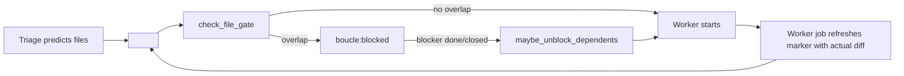

# LOOP — Boucle product reference

Configuration reference for the boucle autonomous dev loop: CI/CD
variables, deploy modes, review modes, gates, caps, doctor, notifications,
retry strategy, provider probe, prompt budget. This is the **product
documentation** — the same for every consumer, synced from the engine repo
via `bin/update` (SYNC_PATHS). A consumer configures its instance by setting
`BOUCLE_*` variables in the forge CI/CD UI; this file is the reference that
tells the operator what each variable does.

Read this file before touching the loop — it documents every option the
engine acts on.

## Purpose

Autonomous dev loop: turn a forge issue into a deployed product, with the
human in the loop at decision points (spec validation, MR approval).

## Cadence

- **Trigger:** webhook (primary); jobs chain to the next role via the trigger
  token.

## Human gates

- **Spec validation** — configurable; default: Size M+ via
  `BOUCLE_SPEC_PROFILE=product`.
- **MR approval** — always human-gated.

## Do-Not-Disturb (DND)

DND is **opt-in** and OFF by default — an autonomous run must be
explicit, never time-based by default. When `BOUCLE_DND_ENABLED=true`,
the spec gate is auto-validated during the quiet window (default
22:00–07:00, configurable via
`BOUCLE_DND_START`/`BOUCLE_DND_END`/`BOUCLE_DND_TZ`). The loop runs
autonomously up to the MR without contacting the human. The skip is
transparent: triage posts an explanatory comment (active window + how
to disable) and applies the `boucle:dnd` flag label so the board shows
WHY the gate was skipped. MR approval stays human-gated.

For **per-issue** autonomy without DND, add the `boucle:autonomous`
label to the issue — the spec gate is skipped for that issue only.

## Caps

- **Iteration cap:** 3 worker runs per issue.
- **Budget cap:** not set at MVP — token-cost logging deferred to post-MVP.

## Escalation

Escalate to a human when:

- iteration cap hit,
- acceptance criteria unclear,
- size:L,
- destructive change proposed.

## Out of bounds

- `.boucle/` state files must not be deleted by agents.

## Deploy targets & review modes

Boucle supports two deploy modes and two review modes, orthogonal and composable.

### Deploy modes (`BOUCLE_DEPLOY_MODE`)

| Mode | Behavior |
|------|----------|
| `self` (default) | Boucle runs `BOUCLE_DEPLOY_CMD` to deploy a preview (worker) and production (post-merge). URL is derived from deploy output via `BOUCLE_DEPLOY_URL_REGEX`, then falls back to `https://${BOUCLE_DEPLOY_PROJECT}.pages.dev`. |
| `external` | Boucle does NOT deploy. Post-merge waits for the consumer's own CI/CD on the merged commit (via `forge_commit_check_suites`), then hands `BOUCLE_LIVE_URL` to e2e. `BOUCLE_LIVE_URL` is **required**. |

### GitLab Pages declarative mode (`BOUCLE_DEPLOY_PROVIDER=gitlab-pages`)

Opt-in token-less deploy path: set `BOUCLE_DEPLOY_PROVIDER=gitlab-pages` and
leave `BOUCLE_DEPLOY_CMD` **empty** (a project variable with an empty value
overrides the YAML default). The forge's own `pages` job builds
`$BOUCLE_BUILD_OUTPUT` and serves it at `$CI_PAGES_URL` — no deploy command.

The site URL **is displayed** in the MR description (`Site (GitLab Pages):
$CI_PAGES_URL`) so the MR does not look like a broken duplicate — even though
the mechanics differ from Cloudflare Pages (no per-branch previews: branch
previews would need GitLab **parallel deployments** (`pages.path_prefix`,
GitLab ≥ 17.9), a **Premium** feature that CE instances ignore *silently* —
a prefixed job publishes at the ROOT and clobbers production; verified
empirically on framagit 2026-08).

The loop adapts automatically to an empty `BOUCLE_DEPLOY_CMD`:

- **Worker** — skips the preview deploy (no `FAIL: no preview URL`); when
  `BOUCLE_DEPLOY_PROVIDER=gitlab-pages` and `$CI_PAGES_URL` is set, the MR
  description carries `Site (GitLab Pages): $CI_PAGES_URL — no per-branch
  preview; reviewed via diff` instead of a blank `Preview:` line.
- **Reviewer** — sees no preview URL (the pages.dev extraction regex cannot
  match the forge's Pages domain) and falls back to **diff review** (code
  review of the MR diff + check suites), same as `BOUCLE_REVIEW_MODE=diff`.
- **Deploy job** — skips cleanly (`deploy: BOUCLE_DEPLOY_CMD is empty`).
- **Post-merge/e2e** — resolves the live URL to `$CI_PAGES_URL` instead of
  the `pages.dev` fallback (which would point at a nonexistent Cloudflare
  project).

An empty `BOUCLE_DEPLOY_CMD` must NEVER fail a job — it is a valid,
complete loop, not a misconfiguration.

### GitHub Pages declarative mode (`BOUCLE_DEPLOY_PROVIDER=github-pages`)

Token-less deploy path for GitHub consumers: set `BOUCLE_DEPLOY_PROVIDER=github-pages`
and leave `BOUCLE_DEPLOY_CMD` **empty** (an empty repo variable overrides the
workflow default). The worker pushes `$BOUCLE_BUILD_OUTPUT` to the `gh-pages`
branch using the bot PAT (`BOUCLE_TOKEN`, which already has `contents: write` —
**no `CLOUDFLARE_API_TOKEN` needed**), and the post-merge deploy re-pushes the
merged build. The site is served at `https://<owner>.github.io/<repo>/`
(see `boucle_github_pages_url`).

The loop adapts automatically:

- **Worker** — stamps the SHA marker, pushes the build to `gh-pages`, and
  records the site URL; the MR description carries `Site (github-pages):
  https://<owner>.github.io/<repo>/ — no per-branch preview; reviewed via
  diff`.
- **Reviewer** — sees no preview URL and falls back to **diff review**,
  same as GitLab Pages declarative mode.
- **Deploy job** — re-pushes the merged build to `gh-pages` (keeps
  production in sync) and chains e2e with `BOUCLE_LIVE_URL` set to the
  canonical site URL.
- **Post-merge/e2e** — resolves the live URL to `boucle_github_pages_url`
  instead of the `pages.dev` fallback.

The consumer's GitHub Pages must be configured to serve from the `gh-pages`
branch (Settings → Pages → Source: Deploy from a branch → `gh-pages` / root).


### Review modes (`BOUCLE_REVIEW_MODE`)

| Mode | Behavior |
|------|----------|
| `preview` (default) | Worker deploys preview, reviewer tests against `BOUCLE_PREVIEW_URL` extracted from MR description via `BOUCLE_DEPLOY_URL_REGEX`. SHA-anchored freshness assertion. |
| `diff` | Worker skips preview deploy. Reviewer runs code-review mode: fetches PR diff via `forge_mr_diff`, waits for PR check suites via `forge_mr_check_suites` (bounded by `BOUCLE_REVIEW_CHECKS_WAIT`, default 900s), plus instructed-content fidelity checks. Verdict stays SHA-anchored. |
| `screenshot` | Worker builds the site, serves it locally (`python3 -m http.server` — zero dependencies), captures screenshots of impacted pages via puppeteer/chromium (reusing `bin/render-preview.cjs` with HTTP URL support), uploads them as MR attachments. Reviewer receives the screenshots as text descriptions via `bin/describe-images --criteria` — the vision model answers each acceptance criterion (MET/NOT MET/UNCLEAR) from `state.md`, and the reviewer grades against those text descriptions. No deploy command, no token, no CDN propagation wait. Ideal for GitLab CE (no per-branch Pages) or any token-less setup where visual review still matters. Fail-open: a screenshot failure degrades to diff review, never blocks the loop. |

### Per-provider URL regex defaults

| Provider | `BOUCLE_DEPLOY_URL_REGEX` default |
|----------|-----------------------------------|
| Cloudflare Pages | `https://[a-z0-9.-]+\.pages\.dev` |
| GitHub Pages | `https://[a-z0-9-]+\.github\.io(?:/[\w-]+)?` |
| GitLab Pages | Prefer `$CI_PAGES_URL` (predefined); fallback regex: `https://[a-z0-9-]+\.[a-z0-9-]+\.gitlab\.io(?:/[\w-]+)*` |

GitLab Pages unique-domain mode uses random 6-char IDs — use `BOUCLE_LIVE_URL` or `$CI_PAGES_URL` instead of regex.

## CI/CD variables

Complete reference of all boucle CI/CD variables (set as repo secrets/variables). Defaults shown; override per-consumer. `bin/setup` seeds defaults where possible (e.g. `BOUCLE_DND_TZ` from the installing machine's timezone, fallback model variables).

| Variable | Default | Purpose |
|----------|---------|---------|
| `BOUCLE_ENABLED` | `true` | Master switch: `true` or `false` (pause boucle). |
| `BOUCLE_FORGE` | *(auto-detected)* | Active forge: `gitlab` or `github`. Auto-detected from the origin git remote (github.com → github, gitlab.com → gitlab, self-hosted via hostname heuristic or API probe). Override with a subcommand (`setup gitlab` / `setup github`), `--forge`, or `BOUCLE_FORGE`. |
| `BOUCLE_MONO_USER` | *(empty)* | `true` when one account owns both the issues and the loop (the default when no `--bot-id` is given). Swaps the actor-based anti-loop guard for the `<!-- boucle:agent -->` marker, drops the `boucle::status::*` gross label and both assignee side effects. `false` is treated as unset. Degrades notifications — see README. |
| `BOUCLE_SPEC_PROFILE` | `product` | Spec validation profile: `product` (default, gates Size M only), `strict` (gates all sizes), `off` (never); unknown → `product`. |
| `BOUCLE_DND_ENABLED` | `false` | Do-Not-Disturb master switch: `true` (opt-in) or `false` (default). |
| `BOUCLE_DND_START` / `BOUCLE_DND_END` | `22:00` / `07:00` | Quiet-hours window: HH:MM 24h start/end. |
| `BOUCLE_DND_TZ` | `UTC` | Quiet-hours timezone (IANA name, e.g. `Europe/Paris`); seeded by `bin/setup` from the machine's timezone. |
| `BOUCLE_DND_EXCLUDE_DAYS` | *(empty)* | Comma-separated weekday names never in DND (e.g. `Fri,Sat`). |
| `BOUCLE_DEPLOY_MODE` | `self` | Deploy mode: `self` (boucle runs `BOUCLE_DEPLOY_CMD`) or `external` (consumer's own CI/CD deploys). |
| `BOUCLE_REVIEW_MODE` | `preview` | Review mode: `preview` (tests deployed preview), `diff` (reviews PR diff + check suites), or `screenshot` (builds locally, captures screenshots of impacted pages, reviewer grades via vision-model descriptions guided by acceptance criteria). Auto-falls back to `diff` when no preview URL could be extracted (e.g. GitLab Pages declarative mode). |
| `BOUCLE_DEPLOY_PROVIDER` | *(empty)* | Deploy provider profile: `gitlab-pages` (declarative, token-less — leave `BOUCLE_DEPLOY_CMD` empty, live URL = `$CI_PAGES_URL`) or `github-pages` (declarative, token-less — worker pushes `$BOUCLE_BUILD_OUTPUT` to `gh-pages`, live URL = `https://<owner>.github.io/<repo>/`). Empty = deploy via `BOUCLE_DEPLOY_CMD`. |
| `BOUCLE_DEPLOY_CMD` | `npx wrangler pages deploy ...` | Deploy command (self mode). |
| `BOUCLE_DEPLOY_URL_REGEX` | `https://[a-z0-9.-]+\.pages\.dev` | Regex to extract URL from deploy output. |
| `BOUCLE_DEPLOY_PROJECT` | `""` | Cloudflare Pages project name (self mode). |
| `BOUCLE_LIVE_URL` | `""` | Production/live URL (overrides regex/pages.dev fallback; **required** in external mode). |
| `BOUCLE_PRODUCTION_URL` | `""` | Production URL fallback for e2e. |
| `BOUCLE_PREVIEW_MARKER_PATH` | `__boucle_commit__.txt` | SHA marker probe path (relative to URL root). |
| `BOUCLE_PREVIEW_PROPAGATION_WAIT` | `60` | Seconds to wait for preview CDN propagation. |
| `BOUCLE_PREVIEW_DISABLE` | `false` | Skip Chromium visual preview in triage: `true` or `false`. |
| `BOUCLE_PREVIEW_VIEWPORTS` | `390x844,1440x900` | Viewports rendered for the triage mockup, comma-separated `WxH`. One screenshot per entry, labelled by device class in the triage comment. Total bytes respect `BOUCLE_IMAGE_TOTAL_MAX_BYTES`; a malformed entry is skipped, and one failing viewport never loses the others. |
| `BOUCLE_EXTERNAL_DEPLOY_WAIT` | `600` | Max seconds to wait for consumer's own CI on merged commit. |
| `BOUCLE_FILE_GATE` | `true` | Enable the file-impact gate. MR 1: declared marker + `check_file_gate` defers a worker whose issue claims files already claimed by an in-flight issue. MR 2 (deferred): adds a `git merge-tree` safety-net gate. `false` = disabled (fail-open, legacy behavior). |
| `BOUCLE_REVIEW_CHECKS_WAIT` | `900` | Max seconds to wait for PR check suites in diff mode. |
| `BOUCLE_BUILD_CMD` | `npm ci && npm run build` | Build command. |
| `BOUCLE_BUILD_OUTPUT` | `public` | Build output directory. |
| `BOUCLE_BUILD_FEEDBACK` | *(empty)* | Build error tail from the previous failed `BOUCLE_BUILD_CMD` run, injected into the next worker iteration's prompt. Auto-managed — do not set manually. |
| *(no variable)* | *untagged* | GitLab runner routing. Jobs run untagged on shared runners by default. Pinning to a dedicated runner is a `default: tags:` block in the **root shim**, written by `bin/setup --runner-tag <tag>` — not a CI variable, because GitLab expands `tags: [$VAR]` with an empty `VAR` into `tags: [""]`, which matches no runner and strands the job. See README "Advanced — dedicated runners". |
| `BOUCLE_RUNS_ON` | `ubuntu-latest` | Runs-on expression (GitHub). JSON array of labels for a self-hosted runner, e.g. `["self-hosted", "linux", "x64"]`. |
| `BOUCLE_MAX_PARALLEL_ISSUES` | `5` | Max concurrent boucle:working issues (`0` = unlimited). |
| `BOUCLE_MAX_ITERATIONS` | `5` | Max worker re-runs per issue before escalation. |
| `BOUCLE_STALENESS_THRESHOLD` | `2400` | Seconds before a stuck issue is re-triggered (must exceed max job timeout, 30 min). |
| `BOUCLE_SCHEDULES_ENABLED` | `false` | Opt-in: create issues from `.boucle/schedules/*.md` when their cron is due. |
| `BOUCLE_BOARD_ENABLED` | `true` | Maintain a pinned status-board issue answering "what is waiting on me?". |
| `BOUCLE_DOCTOR_ADAPTIVE` | `true` | Skip the full sweep when the board has not moved since the last check. |
| `BOUCLE_DOCTOR_BACKSTOP` | `21600` | Seconds after which a full sweep runs regardless of the fingerprint (6 h). |
| `BOUCLE_STALENESS_IDLE_FACTOR` | `3` | Multiplier applied to `BOUCLE_STALENESS_THRESHOLD` when nothing is in flight. |
| `BOUCLE_UPDATE_MODE` | `release` | Update mode: `release` (pinned engine release) or `dev` (tracking branch). |
| `BOUCLE_LLM_BASE_URL` | — | LLM API endpoint (any OpenAI-compatible). |
| `BOUCLE_LLM_API_KEY` | — | LLM API key (masked secret). |
| `BOUCLE_VISION_ROUTING` | `enabled` | Vision model routing: `enabled` or `disabled`. |
| `BOUCLE_VISION_MODEL` | `minimax-m3` | Vision model for image-enabled roles. |
| `BOUCLE_VISION_ROLES` | `triage,worker,reviewer` | Roles eligible for vision model routing (comma-separated). |
| `BOUCLE_FALLBACK_PROVIDER` | *(empty)* | Fallback provider profile name; empty = disabled. Requires `BOUCLE_FALLBACK_BASE_URL` + `BOUCLE_FALLBACK_API_KEY` (masked). Retries on exit-4 (provider down / quota exhausted) before escalating. |
| `BOUCLE_FALLBACK_BASE_URL` | *(empty)* | Fallback provider endpoint (OpenAI-compatible). |
| `BOUCLE_FALLBACK_API_KEY` | *(empty)* | Fallback provider key (masked secret). |
| `BOUCLE_FALLBACK_MODEL_TRIAGE` | `glm-5.2` | Per-role fallback model overrides. |
| `BOUCLE_FALLBACK_MODEL_WORKER` | `deepseek-v4-flash` | |
| `BOUCLE_FALLBACK_MODEL_REVIEWER` | `glm-5.2` | |
| `BOUCLE_FALLBACK_MODEL_E2E` | `deepseek-v4-flash` | |
| `BOUCLE_PROVIDER_PROFILE` | `boucle` | jcode provider profile name. |
| `BOUCLE_IMAGE_MAX_BYTES` | `10485760` | Max bytes per attachment (10 MiB). |
| `BOUCLE_IMAGE_TOTAL_MAX_BYTES` | `52428800` | Max total bytes per issue (50 MiB). |
| `BOUCLE_PRICING_JSON` | *(empty)* | Per-model price map, USD per 1M tokens: `{"model":{"in":0.10,"out":0.30}}`. Empty = tokens are reported, dollars are not. |
| `BOUCLE_RETRY_STRATEGY` | `adaptive` | Worktree handling on a worker re-run: `adaptive` (reset only after a contamination failure), `preserve` (always keep prior commits), `reset` (always start clean). |
| `BOUCLE_QUOTA_PROBE` | `true` | Ask the provider whether it can answer before spinning up an agent run. |
| `BOUCLE_QUOTA_PROBE_TTL` | `300` | Seconds a probe result is reused, so parallel jobs probe once. |
| `BOUCLE_NOTIFY_URL` | *(empty)* | Send-only webhook for human gates and escalations. Empty = disabled. Set as a **masked** variable. |
| `BOUCLE_NOTIFY_FORMAT` | `slack` | Payload envelope: `slack` (also Discord via a `/slack` endpoint), `ntfy`, `telegram`, `raw`. |
| `BOUCLE_NOTIFY_EVENTS` | `spec-review,approval,human,blocked` | Which transitions fire a notification. |
| `BOUCLE_REVIEW_ANCHORING` | `full` | How much of a prior reviewer verdict reaches the next review pass: `full`, `criteria-only`, `none`. See §Anti-anchored re-review. |
| `BOUCLE_MAX_NOTE_CHARS` | `1500` | Per-note cap when a note thread is injected into a prompt. Every note survives — only its tail is elided. `0` disables trimming (escape hatch). |
| `BOUCLE_MAX_PROMPT_CHARS` | `0` | Thread-level ceiling on the **assembled** prompt. `0` = disabled. See §Prompt budget. |
| `BOUCLE_PROMPT_WARN_CHARS` | `0` | Log a warning above this assembled size without altering the prompt. `0` = never warn. |
| `BOUCLE_ALLOWED_USERS` | *(installer)* | Issue allow-list: comma-separated usernames whose issues boucle accepts. Seeded by bin/setup with the installer's username. Unset/empty = allow list disabled (legacy fail-open). Case-insensitive. |

### Issue allow list

Boucle is a safety net: it only accepts issues whose resolved human author is in
`BOUCLE_ALLOWED_USERS` (comma-separated usernames, case-insensitive match). This
keeps the loop from working on issues filed by anyone with write access to the
repo.

- **Default = the installer.** `bin/setup` seeds the variable with the username
  of the user who runs it. Extend it by adding usernames separated by commas
  (e.g. `alice,bob`) — re-run `bin/setup --allowed-users alice,bob` or set the
  variable directly in the forge UI.
- **Rejection is loud.** An issue from a non-listed author gets a `:lock:` note
  and a visibly failed dispatch pipeline (anti-accumulation) — no label is set,
  so the loop never picks it up.
- **Split sub-issues resolve to the parent's author**, not the bot — the bot is
  never in the allow list, so a split never deadlocks.
- **Fail-open if unset.** An absent or empty variable disables the gate
  entirely (legacy behavior).

### Bot token (GitHub)

On GitHub the bot **is** the account that owns the `BOUCLE_TOKEN` PAT. Create it at
[https://github.com/settings/tokens/new](https://github.com/settings/tokens/new)
with **`repo` + `workflow`** scopes (optionally `admin:org` for
branch-protection checks) — see
[Scopes for OAuth apps](https://docs.github.com/apps/oauth-apps/building-oauth-apps/scopes-for-oauth-apps).
Select a sensible expiration (fine-grained or classic PATs both work; classic
with the two scopes is the simplest).

`bin/setup github` resolves the PAT's account, seeds
`BOUCLE_BOT_USERNAME` with it and stores the PAT as `BOUCLE_TOKEN` (secret). A
**missing, invalid, or expired PAT fails setup with an explicit message** —
the loop never runs half-configured. Renew the PAT and re-run `bin/setup`
(idempotent) when the stored token expires.

### Mono-user mode (`BOUCLE_MONO_USER`)

Mono-user is the **default** when no `--bot-id` is given — one account owns
both the issues and the loop. This is the common case on GitHub, where
nothing provisions a bot account for you.

**Why the mode has to exist.** boucle normally recognises its own writes by
the actor: dispatch discards any webhook whose author is the bot. Point that
at your own account and the guard discards *your* actions too — opening an
issue, replying on `boucle:needs-info`, approving a spec. The loop goes
quiet, with no error anywhere. Mono-user swaps the actor check for an
invisible `<!-- boucle:agent -->` marker that boucle appends to every comment
it posts, so it recognises its own writes without asking who acted.
`bin/doctor` fails loudly if you land in the broken configuration by
accident.

**The cost: notifications degrade.** The forge signals "it's your turn" by
*changing* an issue's assignee — but the issue is already yours, so nothing
is emitted. And every action the loop takes runs under your token, so forges
do not notify you about your own activity by default. Enable own-activity
notifications (GitHub: Settings → Notifications → Include your own updates;
GitLab: Preferences → Notifications → Receive notifications about your own
activity) or you will hear nothing. Both are account-wide, so expect noise
from the loop's routine comments. GitHub's per-organization email routing
and inbox `reason:` filters help contain it; repository Watch levels keep
unrelated repos quiet. None of this is as clean as a dedicated identity —
prefer a bot or service account when you can, and treat mono-user as the
fallback.

## Scheduled maintenance issues

Boucle has exactly one entry point: a human creates an issue. Its scheduled
job is inward-facing — the doctor heals state, it never produces work. So
recurring maintenance (dependency bumps, accessibility audits, dead-link
sweeps) is work the loop suits but could never start on its own.

Opt in with `BOUCLE_SCHEDULES_ENABLED=true` and drop templates in
`.boucle/schedules/*.md` — an issue body with YAML frontmatter
(`cron`, `title`, `labels`, `enabled`). When the cron is due, boucle creates
the issue with `boucle:triage` and the normal loop owns it from there;
nothing about it is special-cased downstream. See
[docs/schedules-example.md](docs/schedules-example.md).

- **Granularity is hourly.** The doctor sweeps every few minutes, so the
  minute field is parsed and ignored. Times are UTC.
- **Never a second issue while a previous one is open**, and a missed window
  fires once rather than once per sweep. Deduplication reads the last firing
  from the forge (a marker in the issue body), not from a runner cache — so
  a fresh runner cannot re-fire a template it already fired.
- **A cron cannot starve human work**: scheduled issues count against
  `BOUCLE_MAX_PARALLEL_ISSUES` like any other.
- **A malformed template is skipped with a warning**, never fatal, and never
  blocks the other templates.

## Status board

Boucle's state is fully legible — it lives in labels — but only if you know
which labels to filter on and you go looking. With five issues in flight
plus blocked and dependent ones, nothing answered *what is waiting on me?*

The doctor maintains one issue, `➰ boucle — status board` (label
`boucle:board`), with four sections: **Waiting on you**, **In flight**,
**Blocked**, **Waiting on a dependency**.

- It is **a forge issue**, not a web app. The forge is the UI — that is the
  whole thesis (`CONTEXT.md` §7).
- It is **edited in place** and never commented on. `CONTEXT.md` §8 already
  warns that no-op writes pollute the event history; a board that comments
  would be worse. An unchanged body produces **zero** API writes.
- It is **never dispatched**. Creating it fires an issue webhook like any
  other, so the dispatcher exits early on `boucle:board` — otherwise the
  loop would start working on itself.
- Deleting it by hand simply makes the next sweep recreate it.

## Configuration audit

`bin/doctor --audit` is read-only and forge-independent: it checks that the
**configuration** is coherent, which is the class of problem otherwise
discovered mid-loop, one failed run at a time.

```
$ bin/doctor --audit
  ✗ BLOCKER  BOUCLE_DEPLOY_MODE=external without BOUCLE_LIVE_URL
             → external mode never deploys, so e2e has no target. Set BOUCLE_LIVE_URL at …

Readiness: 54/100  (1 blocker(s), 0 degraded, 2 advisory)
```

| Severity | Meaning | Weight |
|---|---|---:|
| **blocker** | The loop cannot complete | −40 |
| **degraded** | Works, silently wrong (an inert fallback, a re-trigger that fires mid-job) | −15 |
| **advisory** | Worth knowing (a UTC quiet window, a missing design charter) | −3 |

Blockers dominate on purpose: a repository that cannot complete a loop must
not score well because everything else is tidy. A blocker exits non-zero, so
the audit works as a CI check.

`bin/setup` prints it on completion — you learn what is missing before the
first issue, not during it. It never fails the install: a blocker there is a
variable you set in the forge UI afterwards.

## Doctor cadence

The doctor ran on a fixed schedule and always performed the full sweep — on
an idle repository, a runner provisioned to confirm nothing changed.

It now fingerprints the board first (every boucle-labelled open issue and
when it last moved) and skips the sweep when nothing has shifted. A backstop
forces a full sweep every `BOUCLE_DOCTOR_BACKSTOP` regardless, so a stale
fingerprint cannot strand the board. When nothing is in flight, the
staleness threshold is relaxed by `BOUCLE_STALENESS_IDLE_FACTOR`; the busy
value is unchanged and still exceeds the max job timeout.

**Two deliberate degradations**, both toward doing more work rather than
less:

- A listing that fails produces an empty fingerprint and a full sweep. The
  doctor exists to unstick things; a probe that cannot see the board must
  never be the reason it stops.
- The snapshot lives in the state cache, which survives on a shell-executor
  runner. On an **ephemeral runner (GitHub-hosted) it is never found**, so
  every run is a full sweep — the old behaviour exactly. No regression, and
  no saving either.

## Cost accounting

Every agent invocation appends one entry to `.boucle-state/<issue>/cost.json`
(role, iteration, model, provider, tokens, cost) and emits a
`[boucle:metrics]` line. The accumulator survives across iterations like
`iterations.md`, so a re-run adds to the total instead of overwriting it.
The MR description carries a `### Cost` breakdown grouped by role.

Two deliberate refusals:

- **No dollars without `BOUCLE_PRICING_JSON`.** Prices drift and boucle is
  provider-agnostic; hardcoding them in the engine would produce confident
  wrong numbers. Unset, you get token counts.
- **No fabricated token counts.** Providers report usage inconsistently and
  some not at all. A missing count records `n/a` and the run continues.

A run that fell back is attributed to the **fallback** model, not the
primary — otherwise the breakdown blames the wrong provider. When only some
runs are priced, the total is flagged as a lower bound.

This is the prerequisite for a real budget cap (§Caps below still reads
"not set at MVP"): measure first, cap second.

## Loop-health measurement

Every agent run appends one JSONL line to `.boucle-state/<issue>/health.jsonl`
(role, iteration, exit_code, prompt_chars, tokens, cost, model, provider),
and every stage outcome appends another (worker: committed/no-changes/
build-fail; reviewer/e2e: PASS/FAIL/UNCERTAIN; merger: merged/conflict).
The file survives across iterations like `cost.json` and feeds two consumers:

- `bin/health <issue>` — a read-only per-issue health summary (iterations,
  outcomes by role, cost total, last verdict, failure class if escalated).
- **Structured escalation diagnostics** — when the loop escalates to
  `boucle:human`, the generic "human intervention needed" comment is
  replaced by `boucle_escalation_diagnostic`, which classifies the failure
  (provider/quota, build-fail, no-changes, rebase-conflict,
  not-mergeable, unknown) from the health record and posts a structured
  diagnostic: failure class + evidence + recommended next action.

This is the "look at the data" principle applied to the loop itself, and
the prerequisite for the upstream engine-defect flywheel (#54).

## Retry strategy

Boucle already gets most of a Ralph-style recovery cycle for free: every
iteration is a fresh CI job and a fresh agent process, so no conversation
survives, and `iterations.md` carries the failure trace forward. The one
piece that was missing is the worktree reset.

| Previous iteration ended with | `adaptive` does | Why |
|---|---|---|
| A reviewer FAIL (code was shipped) | **Preserve** and rebase | The fix is incremental; discarding valid work burns iterations re-doing it |
| No code changes / step budget exhausted | **Reset** to the default branch | The safety-net commit makes the half-written tree durable, so N+1 would spend its budget working out what N was in the middle of |

`preserve` reproduces the old behaviour, `reset` always starts clean, and an
unknown value falls back to `preserve` — which never destroys work.

**A reset never loses work silently.** The discarded head is tagged
`boucle/<issue>/discarded-<timestamp>`, the tag is pushed so the commits
survive the branch force-push, and the tag is named in an issue comment.
`state.md` and `iterations.md` survive untouched — they are restored from
the state cache after checkout. Only the *code* is discarded; the notes on
why the previous attempt failed are exactly what the fresh run needs.

## Provider probe

Boucle used to discover an exhausted quota the expensive way: provision the
runner, clone the repo, build the prompt, run the agent, burn the retry
budget, *then* fall back. With `BOUCLE_MAX_PARALLEL_ISSUES=5` that waste is
multiplied by five before anyone notices.

The probe asks first — one cheap request to `<base_url>/models`:

| Response | Meaning | Action |
|---|---|---|
| `2xx` | ok | Run normally |
| `429`, `402` | quota exhausted | Switch to the fallback **before** the run, consuming no retry budget |
| `5xx` | provider down | Same |
| `401`, `403` | auth problem | Same, and the status is named in the escalation |
| unreachable | unknown | **Run anyway** |

When neither provider can answer, boucle does not start the agent: it exits
with the established provider-down code (4), CI posts a diagnostic and
escalates. Burning a runner to produce nothing is the worst outcome.

**This does not replace the reactive path.** A quota can be exhausted
mid-run, and only the in-flight fallback catches that. The probe removes the
waste in the case that was knowable in advance.

**Fail-open by construction.** An unreachable or unparseable probe runs the
agent anyway — a runner with flaky egress must not stop the loop. The probe
is an optimisation; it must never become a new failure mode.

## Notifications

The loop is asynchronous by design — you are not meant to watch it. But the
forge's own emails arrive with the same weight as any other repository
activity, so the two moments that actually need you (spec gate, MR gate)
look identical to a label tweak.

Set `BOUCLE_NOTIFY_URL` and boucle POSTs to it on four transitions:
`spec-review`, `approval`, `human`, `blocked`. Narrow the list with
`BOUCLE_NOTIFY_EVENTS`. Routine transitions (`working`, `review`, `todo`,
`done`, `merging`) never fire — a channel that pings on every state change
gets muted within a day, which is worse than silence.

**Send-only, on purpose.** `CONTEXT.md` §7 forbids a new frontend, a server,
or a machine to keep running. boucle POSTs; nothing listens. To reply, you
comment on the issue or the MR — the loop already reads those.

| Format | Endpoint | Body |
|---|---|---|
| `slack` (default) | Slack incoming webhook, or a Discord webhook with `/slack` appended | `{"text": "…"}` |
| `telegram` | `https://api.telegram.org/bot<TOKEN>/sendMessage?chat_id=<ID>` | `{"text": "…"}` |
| `ntfy` | `https://ntfy.sh/<topic>` | plain text |
| `raw` | anything | `{"event","issue","title","url","waiting_for"}` |

Two guarantees:

- **Fail-open.** A webhook that times out, 404s or 500s logs a warning and
  the job continues. A dead webhook must never block the loop.
- **Silent during DND.** Notifications are suppressed inside the quiet
  window — not being contacted is the entire point of it.

Notifications fire on the **transition**, never on the state: the doctor
sweep re-applies labels that are already set, and notifying on presence
would re-fire on every sweep.

## Anti-anchored re-review

On iteration N the reviewer reads its **own** iteration N-1 verdict. That
invites two opposite failures:

- **ratification** — the previous reasoning gets re-endorsed, and a
  regression introduced *by* the fix slips through unexamined;
- **tunnel vision** — only the previously failed criteria get re-checked.

| `BOUCLE_REVIEW_ANCHORING` | What the reviewer sees of a prior verdict |
|---|---|
| `full` (default) | Everything — the verdict, met and unmet criteria, and the reasoning |
| `criteria-only` | The `VERDICT:` line and the unmet `- [ ]` criteria, with the rationale stripped: what must still pass, not why it failed |
| `none` | A placeholder; the verdict is withheld |

Two things are never filtered, at any setting:

- **Human comments.** They amend the spec and outrank the frozen criteria in
  `state.md`. Withholding one is a spec regression, not a saving.
- **Bot notes that are not verdicts** (CI status notes). They carry loop
  context, not review reasoning.

The **worker** always receives full verdict reasoning — it has to act on a
FAIL, so it needs the why. Only the reviewer's own view is filtered.

**The default is `full` on purpose.** Withholding prior verdicts is not
obviously correct: a reviewer that forgets what it already rejected can
flip-flop across iterations, and the worker then chases a moving target and
burns the iteration cap. Turn on `criteria-only`, compare verdict stability
across iterations on real issues, and only then decide. An unknown value
falls back to `full` rather than filtering blind.

## File-impact gate

Parallel workers (`BOUCLE_MAX_PARALLEL_ISSUES` > 1) on separate branches
`boucle/<iid>` can edit the same files and conflict at rebase/merge time. The
file-impact gate defers a worker before it starts when its issue claims files
already claimed by an in-flight issue.



### How it works

- **Triage** embeds a `<!-- boucle:files v=1 paths=path1,path2 -->` marker
  in its spec comment (the `## Fichiers impactés` section), predicting the
  files the issue will touch (source, styles, charter docs). The file claim
  lives in the spec the human reviews, not a separate note. Absent marker =
  no claim → fail-open (the gate passes).
- **`check_file_gate`** (3rd gate, after `check_dependencies_and_gate` and
  `check_sibling_gate`) compares the issue's marker against in-flight issues'
  markers (open issues labeled `boucle:working`/`review`/`approval`/`merging`).
  Non-empty intersection → `boucle:blocked` + explanatory note; the worker is
  NOT triggered.
- **Worker job** refreshes the claim in a separate machine note with the
  actual branch diff (`git diff --name-only origin/<default>...HEAD`) after
  each run. It targets the newest marker note that is NOT the triage spec
  comment (updating the spec comment would destroy the human-visible spec),
  posting a new note on the first refresh. The gate picks the newest marker
  note, so the refresh supersedes the triage prediction. The refresh is
  skipped when the branch has no commits ahead (e.g. after an adaptive
  reset), preserving the last non-empty claim mid-flight.
- **`maybe_unblock_dependents`** (catchup + e2e) unblocks a file-blocked issue
  directly when the named blocker reaches `done`/`closed`.

### Invariants

- Only active issues hold claims; blocked issues claim nothing → no deadlock.
- Self-exclusion on re-triggers.
- Fail-open on missing marker / forge API error.
- The sibling gate stays (belt-and-suspenders); the file gate is finer-grained
  (siblings on different files run in parallel).

### Configuration

`BOUCLE_FILE_GATE` (default `true`) enables the gate. `false` = disabled
(legacy behavior). The gate is fail-open by construction: an issue that does
not declare files is unaffected.

### MR 2 (deferred): `git merge-tree` safety net

A second gate at worker startup (iter 2+) runs `git merge-tree --write-tree
--name-only` against each in-flight `origin/boucle/*` branch to catch
prediction drift (a file the marker missed that actually conflicts). Deferred
until MR 1's residual conflict rate justifies it; the existing conflict-retry
budget (`BOUCLE_CONFLICT_RETRIES`) backstops drift until then.

## Agent transcript

Every agent job uploads `agent-output.log` as a CI artifact (`when: always`
on GitLab, `if: always()` on GitHub, 7-day retention). A failed run is
exactly the one whose transcript matters, so it is uploaded on failure too.

Every escalation comment — "produced no code changes", "not mergeable",
"human intervention needed" — carries a link to the job that produced it.
Follow the link, open the artifacts, read the transcript.

The log is **scrubbed before it leaves the runner**: `bin/jc` redacts the
values of `BOUCLE_LLM_API_KEY`, `BOUCLE_FALLBACK_API_KEY`, `BOUCLE_TOKEN`,
`BOUCLE_BOT_TOKEN` and the Cloudflare token, plus generic token shapes
(`ghp_…`, `glpat-…`, `sk-…`, `Bearer …`). Redaction is literal, not
regex-based, so a key containing regex metacharacters is still caught. It
runs before every exit path, including the failure ones.

## Prompt budget

`BOUCLE_MAX_NOTE_CHARS` bounds the **worst note**; it does not bound the
**assembled prompt**. A note thread grows monotonically (triage analysis,
per-criterion reviewer verdicts, CI status notes, human comments), so forty
notes at 1500 chars is 60k chars that pass through untouched. Context rot
does not raise an error — the agent silently misses a file, which surfaces
one stage later as a reviewer FAIL and burns an iteration.

**Measure before you cap.** Every agent invocation logs an assembled size on
stderr:

```
[boucle:prompt] total role=worker iteration=2 total_chars=48213 est_tokens=12053 body_chars=1840 notes_chars_raw=51002 feedback_chars_raw=9310 ceiling=0
```

Set `BOUCLE_PROMPT_WARN_CHARS` first to see how close your repository runs,
then set `BOUCLE_MAX_PROMPT_CHARS` from observed values. Choosing a ceiling
blind truncates legitimate context.

When the ceiling is exceeded, boucle tightens **bot-authored notes only**,
along the ladder 750 → 300 → 120 chars, stopping at the first rung that
fits. Two invariants hold at every setting:

- **Human comments are never trimmed.** They amend the spec and take
  precedence over the frozen acceptance criteria in `state.md`; a truncated
  human amendment is a spec regression, not a saving.
- **No note is ever dropped.** Only tails are elided — the early
  preservation instructions must keep standing alongside later amendments.

If the floor is reached and the prompt still exceeds the ceiling, boucle
logs a warning and proceeds. It will not close the gap by dropping notes.

## Bug policy

See `.jcode/UPSTREAM-FIX-WORKFLOW.md` — fix upstream in boucle first, then
update the consumer, then remediate existing data. Never patch a consumer to
work around a boucle defect.
