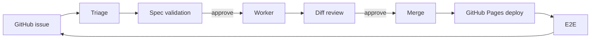

# LOOP.md — boucle.dev loop configuration

> **Maintenance** — This document is **consumer-owned**. It describes how
> boucle is configured for **boucle.dev** (the consumer), not boucle the
> engine. It is NEVER overwritten by `bin/update` (see
> [AGENTS.md](AGENTS.md) "Reference files"). Read it before touching the
> loop. For the engine's full product reference (every `BOUCLE_*`
> variable), see `.boucle/LOOP.md`.

## Purpose

boucle.dev is the landing page for **boucle** — a zero-code autonomous
product builder. The loop turns a GitHub issue into a deployed feature on
the site, with the human in the loop at decision points (spec validation,
PR approval). The site is a static Astro page deployed to GitHub Pages.

## Loop flow

## Forge

- **Forge:** GitHub (`BOUCLE_FORGE=github`).
- **Repo:** `ankaboot-source/boucle.dev`.
- **Mono-user mode:** enabled (`BOUCLE_MONO_USER=true`). One account owns
  the issues, the PRs and the loop's own actions. The anti-loop guard uses
  the `<!-- boucle:agent -->` marker instead of an actor check.

## Deploy

- **Provider:** GitHub Pages (`BOUCLE_DEPLOY_PROVIDER=github-pages`).
- **Mechanism:** token-less declarative deploy. The worker pushes the build
  output (`dist/`) to the `gh-pages` branch using the bot PAT
  (`BOUCLE_TOKEN`, `contents: write`). No `CLOUDFLARE_API_TOKEN` needed.
- **Site URL:** `https://ankaboot-source.github.io/boucle.dev/` (served
  from the `gh-pages` branch, root).
- **No per-branch preview:** GitHub Pages has no per-branch previews, so
  the reviewer falls back to **diff review**.

## Review mode

- **Mode:** `diff` (`BOUCLE_REVIEW_MODE=diff`). No per-branch preview.
- The worker skips the preview deploy. The reviewer runs code-review mode:
  fetches the PR diff, waits for PR check suites (bounded by
  `BOUCLE_REVIEW_CHECKS_WAIT`, default 900s), plus instructed-content
  fidelity checks. Verdict stays SHA-anchored.

## Cadence

- **Trigger:** webhook (primary) — issues, PRs, comments, reviews. Jobs
  chain to the next role via the trigger token.
- **Doctor:** scheduled every 10 minutes (`schedule: "*/10 * * * *"`).
- **Self-update:** `BOUCLE_UPDATE_MODE=release` (pinned engine release),
  runs at the start of each pipeline, fail-open.

## Human gates

- **Spec validation** — `BOUCLE_SPEC_PROFILE=product` (default): gates
  Size M+ issues.
- **PR approval** — always human-gated.

## Caps

- **Iteration cap:** 3 worker runs per issue.
- **Max parallel issues:** `BOUCLE_MAX_PARALLEL_ISSUES=5`.
- **Max worker re-runs:** `BOUCLE_MAX_ITERATIONS=5`.
- **Budget cap:** not set at MVP.

## Escalation

Escalate to a human when:

- iteration cap hit,
- acceptance criteria unclear,
- size:L,
- destructive change proposed.

## Out of bounds

- `.boucle/` state files must not be deleted by agents.
- Consumer-owned docs (`README.md`, `LOOP.md`, `CONTEXT.md`,
  `VISUAL-CHARTER.md`) are NEVER overwritten by `bin/update`.

## See also

- [AGENTS.md](AGENTS.md) — Agent guide, mandatory principles
- [CONTEXT.md](CONTEXT.md) — Project context, tech stack, constraints
- [README.md](README.md) — Overview, getting started, usage
- `.boucle/LOOP.md` — Engine product reference (all `BOUCLE_*` variables)
