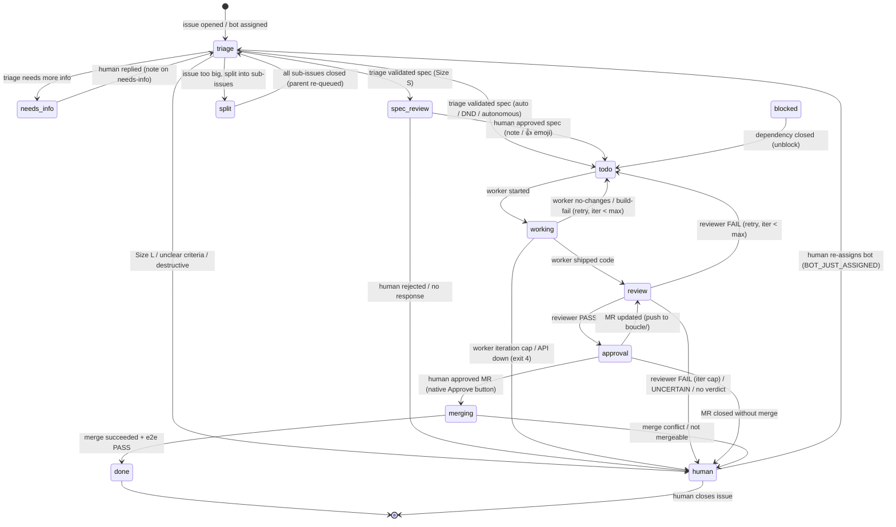

# SKILL.md — Boucle protocol

> **Source of truth for the boucle protocol.** This file is the behavioral
> contract: the labels, markers, state machine, and handoff rules that boucle
> speaks. It is runtime-agnostic (does not reference jcode internals) and
> forge-agnostic (covers GitLab + GitHub). A local harness (opencode, jcode,
> pi, or any agent runtime that reads markdown) loads this skill to "speak
> boucle" — interact with a boucle loop on any consumer repo correctly.
>
> **Projection at install:** `bin/setup` symlinks `.jcode/skills/boucle/SKILL.md`
> → `../../SKILL.md` so the consumer's harness loads it from the conventional
> skills directory. The source is this file; the symlink is the projection.
>
> **Enforcement:** `bin/check-doc-sync` validates that the labels and markers
> in the engine code match this file. A label or marker in code that is absent
> here fails CI red — this file is the spec, not a description.
>
> **Relationship to other charters:**
> - `AGENTS.md` — contribution conventions + mandatory principles. `LESSONS.yml` — lessons (incident
>   catalog). Lessons that state a current protocol invariant cross-reference
>   this file (`See SKILL.md §<id>`); the normative text lives here.
> - `ARCHITECTURE.md` — engine implementation (code structure, forge adapters,
>   CI stages). The *how*, not the *what*.
> - `CONTEXT.md` — identity, audience, philosophy, constraints. The *why*.
> - `README.md` — overview, getting started. The *entry*.

---

## 1. Invariants

The protocol rests on ten invariants. Every agent (CI or local harness) and
every human interacting with boucle MUST honor them. The LESSONS.yml lessons are
incident catalogs that instantiate these invariants; the normative statement
lives here.

### I1 — Forge-native

Boucle lives in the forge. NEVER introduce a new frontend, a server, or a
computer to keep running. The forge is the UI; labels are the state; comments
are the channel. (CONTEXT.md §7, LESSONS.yml lesson #55.)

### I2 — Label-driven state machine

Labels are the source of truth. No external database, no separate state API.
The state machine is driven by `boucle:*` labels (detail axis) + `boucle::status::*`
labels (gross axis: `bot`/`human`/`done`). A label change IS the state
transition. (CONTEXT.md §7.)

### I3 — Async by design

The human is not in front of the screen. Work happens asynchronously, driven
by labels and comments. The loop does not wait for a human reply — it progresses
to the next gate and parks at a human-readable state (`boucle:spec-review`,
`boucle:approval`, `boucle:human`). (CONTEXT.md §1.)

### I4 — Post-early

Post the comment or verdict FIRST, then refine. An incomplete draft posted is
ALWAYS better than a refinement never posted. Step-budget waste (the agent
exhausts its budget without posting) is bug #1. (LESSONS.yml lesson #1, #2, #5.)

### I5 — Idempotence

All `bin/*` scripts and label writes MUST be idempotent. Re-running a script
produces no additional side effects. A label PUT that does not change the label
set is skipped (the forge records a Resource Label Event on every PUT, even a
no-op — CONTEXT.md §8). (LESSONS.yml lesson #4.)

### I6 — SHA-anchored verdicts

Reviewer and e2e verdicts MUST include the commit SHA as bare hex: no quotes, no
whitespace, no angle brackets. Exact format:
`<!-- boucle:verdict v=1 role=reviewer sha=abc123def456 -->`. The CI parser
FAILS if the format is not respected. (LESSONS.yml lesson #6, #41, #47.)

### I7 — Marker-based self-recognition

Boucle recognizes its own writes by an invisible stamp
(`<!-- boucle:agent -->`), NEVER by the actor's identity. A comment posted
without the stamp is treated as a human reply and routed. This is mono-user-safe
(when bot and human share an account, the marker discriminates; the actor does
not). Every comment a harness posts MUST carry the stamp, or dispatch will treat
it as a human reply and re-route. (LESSONS.yml lesson #55.)

### I8 — Doc-as-code

A doc that describes a system that no longer exists is a bug. Charter docs are
maintained as part of each work cycle: triage identifies impacted docs, worker
updates them in the same MR, reviewer verifies conformance, e2e verifies
production match. `bin/check-doc-sync` enforces code ↔ SKILL.md sync in CI.
(AGENTS.md "Documentation self-maintenance".)

### I9 — Upstream-first

Fix upstream (in boucle) FIRST, then update the consumer, then remediate
existing data. NEVER patch a consumer to work around a boucle defect. NEVER
introduce a local workaround that won't be reported upstream. (CONTEXT.md §7,
`.jcode/UPSTREAM-FIX-WORKFLOW.md`.)

### I10 — Serial merge

Merges are serialized via `resource_group: boucle-merge`. Each rebase is
against a `master`/`main` that includes previously-merged MRs. NEVER
parallelize merges — a concurrent rebase against a stale branch produces
conflicts and race conditions. (CONTEXT.md §7, LESSONS.yml lesson #8.)

---

## 2. State machine

The state machine is two-axis: a **detail** label (`boucle:<state>`) that
answers "what is the loop doing?" and a **gross** label
(`boucle::status::<owner>`) that answers "whose side is this on?". In
mono-user mode (`BOUCLE_MONO_USER=true`) the gross axis is dropped (one actor
owns both sides — the question is meaningless).

### 2.1 Detail labels

| Label | Meaning | Owner (gross) |
|---|---|---|
| `boucle:triage` | Awaiting triage analysis | bot |
| `boucle:needs-info` | Triage needs more info from the reporter | human |
| `boucle:spec-review` | Spec validated by triage, awaiting human spec approval | human |
| `boucle:todo` | Spec approved, queued for the worker | bot |
| `boucle:working` | Worker is running | bot |
| `boucle:review` | Worker shipped, awaiting reviewer verdict | bot |
| `boucle:approval` | Reviewer PASSed, MR ready, awaiting human MR approval | human |
| `boucle:merging` | Merger is running (rebase + merge) | bot |
| `boucle:done` | Loop complete (merged + e2e PASS) | done |
| `boucle:human` | Escalated to a human (iteration cap, unclear criteria, destructive change, etc.) | human |
| `boucle:blocked` | Waiting on a dependency (sub-issue not closed) | bot |
| `boucle:split` | Parent issue split into sub-issues, waiting for them | bot |
| `boucle:dnd` | Transient flag: spec gate auto-validated during DND window | (rides along) |
| `boucle:autonomous` | Transient flag: spec gate skipped per-issue opt-in | (rides along) |
| `boucle:board` | The status-board issue (never dispatched) | — |
| `boucle:scheduled` | Issue created by a schedule (cron template) | — |

**Removed (dead labels, pruned from `bin/setup`):** `boucle:approved`,
`boucle:spec-approved`. MR approval uses the native forge Approve button; spec
approval uses a reply/emoji on `boucle:spec-review`. Neither uses a label.

### 2.2 Gross labels

| Label | Meaning |
|---|---|
| `boucle::status::bot` | The loop owns the next action (issue assigned to bot) |
| `boucle::status::human` | A human owns the next action (issue assigned to human reporter) |
| `boucle::status::done` | Terminal (loop complete) |

### 2.3 State diagram



### 2.4 Transition table

The transition table is derived from the handoff primitives in §4. Every
transition is effected by `set_boucle_label <iid> <detail> <gross>` (lib/boucle.sh:626),
which preserves non-boucle labels, writes the detail+gross pair idempotently,
reassigns the issue (bot on `boucle::status::bot`, human reporter on
`boucle::status::human`), and fires the outbound notification on the
transition (never on the state).

---

## 3. Marker reference

Boucle communicates via invisible HTML-comment markers stamped on issue/MR
comments and via structural sections in comment bodies. The markers are
machine-readable; the structural sections are detected by pattern. A local
harness MUST use the markers correctly or dispatch will misroute its writes.

### 3.1 Self-recognition marker

| Marker | Format | Written by | Parsed by | Purpose |
|---|---|---|---|---|
| `<!-- boucle:agent -->` | bare HTML comment | `stamp_agent_marker` (bin/forge/common.sh:81) on every `forge_issue_note` / `forge_mr_note` | `has_agent_marker` (bin/forge/common.sh:92) in dispatch.sh:99-103 | Distinguishes boucle's own writes from human replies. The primary anti-loop guard (invariant I7). A harness posting a comment MUST carry this stamp or dispatch treats it as a human reply and re-routes. |

### 3.2 Triage markers

| Marker | Format | Written by | Parsed by | Purpose |
|---|---|---|---|---|
| `<!-- boucle:triage v=1 -->` | `v=1` (no attrs) | triage agent (final comment); draft promoted by triage.sh:178 (`sed s/draft role=triage/triage v=1/`) | triage.sh:163 (awk), collapse-duplicate-notes:71-72 (jq structural filter) | Marks a final triage comment. CI parser acts on it (sets disposition label, assigns, pauses). |
| `<!-- boucle:draft role=triage -->` | `role=triage` | triage agent (first-pass draft) | collapse-duplicate-notes:73 (filter), triage.sh:178 (promotion source) | Marks a draft triage comment. CI parser does NOT act on drafts; log-scraping fallback promotes to final when the agent exhausts its steps. |
| `<!-- boucle:obligations v=1 -->` | `v=1` | triage.sh:213 | (informational — marks the obligations section of a triage comment) | Marks the obligations block in a triage comment (what the human must do next). |

### 3.3 Verdict markers (reviewer / e2e)

| Marker | Format | Written by | Parsed by | Purpose |
|---|---|---|---|---|
| `<!-- boucle:verdict v=1 role=reviewer sha=<hex> -->` | `v=1 role=reviewer sha=<short-sha>` | reviewer agent (final verdict); draft promoted by reviewer.sh:381 | reviewer.sh:357 (SHA-anchored), :362 (SHA-unanchored fallback) | Marks a final reviewer verdict. SHA MUST be bare hex (no quotes/whitespace/angle brackets) — invariant I6. |
| `<!-- boucle:verdict v=1 role=e2e sha=<hex> -->` | `v=1 role=e2e sha=<short-sha>` | e2e agent (final verdict); draft promoted by e2e.sh:192 | e2e.sh:179 | Marks a final e2e verdict. Same SHA contract. |
| `<!-- boucle:draft role=reviewer -->` | `role=reviewer` | reviewer agent (first-pass draft) | collapse-duplicate-notes:79, reviewer.sh:381 (promotion source) | Draft reviewer verdict. Parser does NOT act; log-scraping promotes on step exhaustion. |
| `<!-- boucle:draft role=e2e -->` | `role=e2e` | e2e agent (first-pass draft) | collapse-duplicate-notes:86, e2e.sh:187 (promotion source) | Draft e2e verdict. Same as above. |

### 3.4 Dependency / hierarchy markers

| Marker | Format | Written by | Parsed by | Purpose |
|---|---|---|---|---|
| `<!-- boucle:depends-on iids=N,M -->` | `iids=<comma-separated-IIDs>` | triage.sh:755 (on each dependent sub-issue) | bin/lib/depends-on.sh:38 (grep), dispatch.sh:427 (gate check) | Declares sub-issue dependencies. Dispatch gates the worker until all dep IIDs are closed. |
| `<!-- boucle:split-parent iids=N,M -->` | `iids=<comma-separated-IIDs>` | triage (split operation) | catchup.sh:66, doctor.sh:746, e2e.sh:75, triage.sh:518,520 (idempotency guard) | Marks the parent issue of a split with its sub-issue IIDs. Used to cascade closure and detect duplicate splits. |
| `<!-- boucle:blocked v=1 iids=N,M -->` | `v=1 iids=<comma-separated-IIDs>` | dispatch.sh:461, boucle.sh:1136 | (informational — marks the blocked note) | Posted on a sub-issue blocked by open siblings. The label `boucle:blocked` is the state; this marker is the note's machine-readable header. |
| `<!-- boucle:sibling-blocked v=1 sib=N -->` | `v=1 sib=<active-sibling-IID>` | dispatch.sh:508, .gitlab-ci.yml:997 | catchup.sh:86,94, e2e.sh:95,102 (jq parse) | Posted when a sibling sub-issue is still active (working/review/approval). The issue starts automatically once the sibling reaches done/closed — sibling issues share the same domain and run one at a time to avoid merge conflicts. |
| `<!-- boucle:unblocked v=1 by=N -->` | `v=1 by=<closed-dep-IID>` | catchup.sh:100, e2e.sh:109 | (informational — marks the unblock note) | Posted when a dependency closes and the worker starts. |
| `<!-- boucle:e2e-origin v=1 iid=N -->` | `v=1 iid=<origin-IID>` | e2e.sh:267 (on follow-up issues) | boucle.sh:705 (parse, to resolve the original issue from a follow-up) | Carries the original issue IID on a follow-up issue created by e2e FAIL, so the loop can cascade back. |
| `<!-- boucle:e2e-fail v=1 iid=N followup=M -->` | `v=1 iid=<origin-IID> followup=<followup-IID>` | e2e.sh:291 (on follow-up issue created by e2e FAIL) | (informational — links follow-up to origin) | Posted on the follow-up issue created when e2e FAILs, linking it to the original issue for cascade. |
| `<!-- boucle:e2e-escalation v=1 iid=N verdict=X -->` | `v=1 iid=<IID> verdict=<uncertain\|empty>` | e2e.sh:321,357 (on e2e UNCERTAIN or no-verdict) | (informational — structured escalation) | Posted when e2e escalates to human due to UNCERTAIN verdict or no verdict (step exhaustion). Records the verdict reason. |
| `<!-- boucle:sub-issue v=1 -->` | `v=1` | triage (split operation) | triage.sh:566 (skip in parent-body parsing) | Marks a sub-issue body. Used to avoid parsing sub-issue content as parent-issue content. |

### 3.5 Operational markers

| Marker | Format | Written by | Parsed by | Purpose |
|---|---|---|---|---|
| `<!-- boucle:board v=1 -->` | `v=1` | boucle.sh:268 (status board body) | (informational — identifies the board issue) | Marks the status-board issue body. Dispatch skips `boucle:board`-labelled issues; this marker is the body's stamp. |
| `<!-- boucle:catchup v=1 iid=N state=X target=Y -->` | `v=1 iid=<IID> state=<from> target=<to>` | catchup.sh:180 (audit note on direct merge) | (informational — audit trail) | Posted when an MR is merged directly (not via the approval flow). Records the state at merge time for audit. |
| `<!-- boucle:commit sha=<hex> -->` | `sha=<short-sha>` | worker.sh:421-422 (in MR description + build marker) | (preview freshness assertion — worker.sh) | Anchors the MR/build to a commit SHA for preview freshness check (invariant I6-adjacent). |
| `<!-- boucle:diagnostic v=1 iid=N class=X trigger=Y -->` | `v=1 iid=<IID> class=<failure-class> trigger=<trigger>` | boucle.sh:475 (escalation diagnostic) | (informational — structured escalation) | Replaces the generic "human intervention needed" note with a structured diagnostic (failure class + evidence + recommended action). |
| `<!-- boucle:schedule id=<name> -->` | `id=<schedule-name>` | boucle.sh:201 (on scheduled issues) | boucle.sh (dedup — last firing marker) | Marks a scheduled issue with its template name. Used to prevent duplicate firings across sweeps. |
| `<!-- boucle:conflict-retry N -->` | `N=<retry-count>` | boucle.sh:1099 (on re-trigger after rebase conflict) | boucle.sh:1085 (jq parse, count retries) | Posted on each re-trigger after a rebase conflict. Bounded retry count — after N retries, the conflict is handed to the worker agent for resolution. |
| `<!-- boucle:file-blocked v=1 on=N paths=... -->` | `v=1 on=<active-issue> paths=<overlap>` | gates.sh:106 (check_file_gate — defer on file overlap) | gates.sh:192 (unblock path, last marker) | The file-impact gate (LESSONS.yml lesson #62): posted when a worker would edit files claimed by an in-flight sibling issue. The unblock path fires when the named blocker closes. |
| `<!-- boucle:files v=1 paths=... -->` | `v=1 paths=<impacted-files>` | triage agent (embedded in the spec comment's `## Fichiers impactés` section); worker job (lib/boucle-ci/worker.sh, refresh in a separate note after the branch diff) | worker job (jq, find last marker note excluding the spec comment) | File-impact declaration (LESSONS.yml lesson #62): the triage predicts the impacted files inside its spec comment, the worker refreshes the claim in a separate machine note with the actual branch diff. Consumed by `check_file_gate` to defer parallel workers on overlap. |
| `<!-- boucle:evidence-pack v=1 -->` | `v=1` | bin/build-evidence-pack (header first line of the evidence pack) | — | Marks the auto-generated evidence pack (charter doc snapshot + diff brief) attached to escalations. |
| `<!-- boucle:allow-list v=1 user=<username> -->` | `v=1 user=<author-username>` | boucle.sh (check_allow_list_gate — rejection note) | — | Posted on an issue whose resolved human reporter is not in `BOUCLE_ALLOWED_USERS`. The issue is not accepted by the loop (no role triggered). Fail-open when the variable is unset (legacy). |
| `<!-- boucle:interactive v=1 -->` | `v=1` | bin/boucle (cmd_pause, cmd_resume, cmd_restart — interactive harness) | — | Marks a comment posted by the interactive harness (`boucle pause`/`resume`/`restart`). Distinguishes a voluntary human takeover from a `boucle:human` escalation. Informational — dispatch does not act on it. |

### 3.6 Markers NOT in code (do not emit)

| Marker | Status | Note |
|---|---|---|
| *(none currently)* | — | Keep this table empty — a marker that is documented here but emitted by code FAILs `bin/check-doc-sync`. |

### 3.7 Structural signals (not HTML comments)

| Signal | Format | Parsed by | Purpose |
|---|---|---|---|
| `## TL;DR` + `## Disposition` | two section headers in the same comment | collapse-duplicate-notes:71-72, triage.sh:126,141,146 | Structural final-comment detection for triage. A draft only has `## Disposition`; a final has both `## TL;DR` and `## Disposition`. Defense-in-depth: even if the agent uses the wrong marker, the parser won't act on a draft that lacks `## TL;DR`. |
| `## Parent issue\n#N` | section header + issue reference | boucle.sh:699,768,774 (awk) | Resolves the parent IID from a sub-issue body. Used by `resolve_reporter_id`, `fetch-issue-attachments`, `maybe_close_parent`. |
| `## Depends on` | section header | bin/lib/depends-on.sh:57,61 (awk fallback) | Fallback parsing of dependencies when the `<!-- boucle:depends-on -->` marker is absent. Mirrors the `## Parent issue` pattern. |
| `## Approach` | section header in `state.md` | worker.sh:482 (sed extraction), :551 (MR description) | The worker's implementation approach, extracted from `state.md` into the MR description. The reviewer reads it to verify doc conformance. |
| `VERDICT: PASS\|FAIL\|UNCERTAIN` | line-anchored (`^VERDICT:`) | reviewer.sh:299,320,358,363; e2e.sh (same pattern) | The verdict line. MUST be start-of-line anchored in greps (LESSONS.yml lesson #41) — an unanchored grep matches shell traces containing the substring. |
| `BOT_JUST_ASSIGNED` | assignee-change detection | dispatch.sh:504-539 | The real "re-queue after boucle:human" mechanism (§4.1). Detected from `.changes.assignees` on the `issue update` webhook, not from a comment. |
| Emoji `thumbsup` | emoji award on a Note | dispatch.sh:579-587 (`BOUCLE_SPEC_APPROVAL_EMOJIS="thumbsup"`) | Spec approval. Only valid on an issue at `boucle:spec-review`, awarded on a Note (not the issue body). MR approval is the native Approve button, NOT an emoji. |

---

## 4. Handoff protocol

The handoff protocol defines how a human (via the forge UI or a local harness)
interacts with the loop. Every handoff is a webhook event routed by dispatch.
The primitives below are extracted from `lib/boucle-ci/dispatch.sh` — they are
the real mechanisms, not invented verbs.

### 4.1 Re-queue after `boucle:human` — bot reassignment

**`boucle:human` is a dead-end for comments.** A plain note on an issue at
`boucle:human` matches no dispatch branch and falls through to `exit 0` —
nothing happens. The ONLY re-queue path is **re-assigning the issue to the bot**.

When a human assigns the bot to an issue (any idle state: `boucle:human`,
`boucle:needs-info` without reply, unlabeled, `boucle:todo`, `boucle:spec-review`),
the `issue update` webhook fires with an assignee change. Dispatch detects
`BOT_JUST_ASSIGNED` (dispatch.sh:504-539) and routes to triage from any idle
state. This is the explicit "reopen and resume" signal.

**A local harness that wants to re-queue a `boucle:human` issue MUST
re-assign the bot, not post a comment.** (LESSONS.yml lesson #11, #44.)

### 4.2 Spec approval — reply or emoji

To approve a spec (issue at `boucle:spec-review`), the human either:
- posts a **non-bot note** on the issue (dispatch.sh:570-578), OR
- awards a **`thumbsup` emoji** on a note (dispatch.sh:579-587, gated by
  `BOUCLE_SPEC_APPROVAL_EMOJIS="thumbsup"`).

Either triggers `chain_to_role worker`. A note by the bot account (carrying
`<!-- boucle:agent -->`) is skipped — only human notes/emojis count.

### 4.3 MR approval — native forge button

To approve an MR (issue at `boucle:approval`), the human clicks the forge-native
**Approve** button on the MR. This fires the `merge_request approved` webhook
(dispatch.sh:167-185) → `chain_to_role merger`. A 👍 emoji on the MR does NOT
trigger the merger (emoji approval is spec-only).

**Native-approval race** (reviewer.sh:487-497): if the human approves the MR
*before* the reviewer finishes (issue still at `boucle:review`), the `approved`
webhook is silently dropped (dispatch requires `boucle:approval`/`human`). The
reviewer's PASS branch checks `forge_mr_approvals` and triggers the merger
directly to recover.

### 4.4 Push to `boucle/<iid>` — re-review

A push to the worker branch (`boucle/<iid>`) fires `merge_request update`
(dispatch.sh:187-205). If the issue was at `boucle:approval`, it reverts to
`boucle:review` and re-runs the reviewer (the approval is invalidated by the
push). Otherwise it re-runs the reviewer on the updated MR.

### 4.5 MR close — label-dependent

Closing the MR (not merging) fires `merge_request close` (dispatch.sh:207-258):
- `boucle:done` / `boucle:human` → no-op (terminal).
- `boucle:approval` → escalate to `boucle:human` (user decision).
- any other (`boucle:todo`/`working`/`review`/`merging`) → revert to
  `boucle:todo` + `chain_to_role worker` (fresh start).

### 4.6 Comment on MR — worker re-run with feedback

A human comment on the MR (dispatch.sh:331-359) reverts the issue to
`boucle:todo` and re-runs the worker with `BOUCLE_ITERATION=verdicts+1` and the
MR notes injected as `BOUCLE_REVIEWER_FEEDBACK`. This is the feedback channel
that feeds human amendments forward (LESSONS.yml lesson #16, #53).

On GitHub the equivalent event is an `issue_comment` on a **pull request**:
the payload carries `.issue.number` (the PR number) with `.issue.pull_request`
non-null. dispatch must detect this via `dispatch_is_github_pr_comment`
(dispatch.sh:38-49) and route it to the same MR-note handler, resolving the
PR's source branch via `forge_mr_get` (it is not in the payload). Without
this, the PR's (empty) labels would trip the dispatch ABORT gate and human PR
feedback could never re-trigger the worker.

### 4.7 Closed-issue guard

Any webhook (note/emoji/update) on a **closed issue** is a no-op
(dispatch.sh:385-411) — EXCEPT bot assignment, which is the explicit
"reopen and resume" signal (dispatch.sh:404-412). A local harness MUST NOT
re-trigger a closed issue by any other means. (LESSONS.yml lesson #44.)

### 4.8 Anti-loop filters (apply to ALL events)

| Filter | Condition | Action |
|---|---|---|
| boucle's own comment | note body has `<!-- boucle:agent -->` marker | skip (I7) |
| bot-originated event | `ACTOR == BOUCLE_BOT_USERNAME` and action ≠ `merge` | skip |
| system note | `object_attributes.system == true` | skip (AGENTS.md #34) |
| non-boucle branch | source_branch not `boucle/<iid>` | skip |

A local harness posting a comment MUST let the stamp be applied (via
`forge_issue_note` / `forge_mr_note` or by including `<!-- boucle:agent -->`
manually) or its comment will be treated as a human reply and re-route the
loop. (I7.)

### 4.9 Cross-role chaining

Every role transition funnels through `chain_to_role <iid> <role> [var=value]`
(lib/boucle.sh:1030) → `forge_trigger_role` (bin/forge/gitlab.sh:503 /
github.sh:514), which fires a pipeline trigger with `BOUCLE_ISSUE` +
`BOUCLE_ROLE` + extra vars. A local harness does NOT call `chain_to_role`
directly — it sets the label and lets dispatch route on the next webhook, OR
it re-assigns the bot (§4.1) to re-trigger triage.

---

## 5. Forge abstraction contract

The engine speaks to the forge through a thin seam (`bin/forge/<forge>.sh` +
`bin/forge/common.sh`). A local harness interacting with boucle SHOULD use the
same primitives (or their forge-native equivalents) so its writes are
indistinguishable from the engine's.

| Primitive | Signature | Effect |
|---|---|---|
| `forge_issue_note <iid> <msg>` | post a comment on an issue (stamped `<!-- boucle:agent -->`) | |
| `forge_mr_note <mr_iid> <msg>` | post a comment on an MR (stamped) | |
| `forge_issue_labels_get <iid>` | read current labels (comma-separated) | |
| `forge_issue_labels_set <iid> <labels>` | write labels (replaces boucle: set, preserves non-boucle) | |
| `forge_issue_assign <iid> <user_id>` | assign the issue | |
| `forge_mr_diff <mr_iid>` | fetch MR diff | |
| `forge_mr_approvals <mr_iid>` | check native approval state | |
| `forge_mr_check_suites <mr_iid>` | fetch CI check suites | |
| `forge_trigger_role <iid> <role> [vars]` | trigger a role pipeline | |
| `set_boucle_label <iid> <detail> <gross>` | write detail+gross labels idempotently + reassign + notify | |

**Marker stamping is mandatory.** Every comment posted via `forge_issue_note`
or `forge_mr_note` carries `<!-- boucle:agent -->`. A harness that posts via the
raw forge API MUST add the marker manually, or dispatch will treat the comment
as a human reply (I7).

---

## 6. Branch contract

The worker branch is `boucle/<iid>` (e.g. `boucle/42`). The lifecycle:
- **Worker** creates the branch from `master`/`main`, implements, pushes, opens
  an MR targeting `master`/`main`.
- **Reviewer** reviews the MR diff / deployed preview.
- **Merger** rebases the MR onto `master`/`main` (serially, via
  `resource_group: boucle-merge`) and merges.
- **Catchup** closes the issue after merge.

A local harness taking over an issue at `boucle:human` SHOULD work on the
existing `boucle/<iid>` branch (not a new branch) to preserve the worker's
commits. If the branch is stale, rebase onto `master`/`main` before pushing.
If the branch is absent, create `boucle/<iid>` from `master`/`main`.

**Never push to `master`/`main` directly** — the merger owns that transition.
A harness that pushes to `master`/`main` bypasses the serial-merge guard (I10)
and may produce conflicts with in-flight MRs.

---

## 7. Known gaps

- **Dogfood suspended.** The engine repo no longer dogfoods on a consumer
  (urgence-palestine.fr split out). Dogfooding will resume via a dedicated test
  consumer once the engine/consumer separation is stable. Until then, the
  73 LESSONS.yml lessons catalog the forward-looking operating principles; new classes of bugs are
  discovered on real consumers. (CONTEXT.md §1.)
- **Lesson numbering drift.** AGENTS.md has duplicate lesson numbers (#17,
  #22, #23, #24, #27, #28, #29, #41, #42, #47 appear twice). The doc's own rule
  says "never renumber — a pruned entry leaves a gap, not a shift", but
  collisions are not gaps. A curation pass will resolve this; until then,
  reference lessons by their unique first sentence, not by number alone.

---

## 8. Interactive mode

A local harness (opencode, jcode, or any agent CLI that reads markdown) can
take over a boucle issue, work on it interactively, and hand it back to the
loop. This section documents the commands, the protocol, and the conventions
the harness MUST respect.

### Commands

The `bin/boucle` wrapper exposes six verbs. All require forge auth env vars
(see §Forge auth below).

| Command | Action |
|---|---|
| `bin/boucle pause <iid>` | Human takes over. Sets `boucle:human`, saves previous state, posts a comment. |
| `bin/boucle resume <iid>` | Loop resumes. If branch `boucle/<iid>` has commits ahead → `boucle:review` (reviewer + merger). Otherwise restores the previous label. |
| `bin/boucle restart <iid>` | Loop takes the issue from scratch (`boucle:todo`). Does not restore previous state. |
| `bin/boucle status <iid>` | Synthetic view: forge label, assignee, MR status, iteration count, `state.md` content, last 3 iterations. |
| `bin/boucle check <iid>` | Pre-work gate check: file-gate (overlap with in-flight issues), dependency gate, sibling gate. Consultation only — informs, does not block. |
| `bin/boucle log <iid>` | Prints `.boucle-state/<iid>/agent-output.log` (last run trace: tool calls, file reads, git operations). |

### Posting comments

Always use `bin/forge-note` (not raw `glab`/`gh` note commands) so the
`<!-- boucle:agent -->` marker is applied. Without the marker, dispatch
treats the comment as a human reply and re-routes the loop (I7).

```
bin/forge-note issue <iid> --message "comment body"
bin/forge-note issue <iid> --message-file /path/to/message.md
bin/forge-note issue <iid> --message-stdin < file
bin/forge-note mr <mr_iid> --message "comment body"
```

### Read-only inspection

```
bin/health <iid>        # per-issue health summary (iterations, outcomes, cost, verdict)
bin/doctor --audit      # read-only board audit (~20 checks)
```

### Excluded commands (CI-context only)

These `bin/*` commands require CI env vars and are NOT available locally.
Use the local alternatives:

| Excluded | Role | Local alternative |
|---|---|---|
| `bin/describe-images` | Describe images via vision model | The agent CLI reads the image directly with its `Read` tool (opencode supports vision) |
| `bin/fetch-issue-attachments` | Download issue uploads | `glab api projects/:id/issues/<iid>/notes` then `glab api .../uploads/:secret/:filename` (or `gh api ...`) |
| `bin/fetch-mr-attachments` | Download MR uploads | `glab api projects/:id/merge_requests/<iid>/notes` + download |
| `bin/build-evidence-pack` | Extract charter docs + diff brief | The agent CLI reads `AGENTS.md`, `CONTEXT.md`, `LOOP.md`, `SKILL.md` directly with `Read` |
| `bin/render-preview.cjs` | Render preview HTML → PNG | The agent CLI uses the browser tool (opencode browser) or screenshot |
| `bin/collapse-duplicate-notes` | Dedupe bot notes | Not needed in interactive mode (the human controls what they post) |

### Forge auth in local mode

Set these env vars before running `bin/boucle` or `bin/forge-note`:

```bash
export BOUCLE_BOT_TOKEN="glpat-..."   # or GH_TOKEN for GitHub
export BOUCLE_FORGE_HOST="gitlab.com" # or github.com
export BOUCLE_PROJECT_PATH="org/repo" # project path
export BOUCLE_FORGE="gitlab"          # or "github"
```

The agent CLI can also use `glab`/`gh` directly for forge operations (list
MRs, view issues, etc.) — `bin/forge-note` is just a wrapper that applies the
`<!-- boucle:agent -->` stamp.

### Message templates

The `templates/` directory at the repo root contains one `.md` file per
boucle message type, with `{{placeholders}}`. These are the single source
of truth for the format. To produce a boucle-valid message:

1. Read the template (e.g. `templates/triage.md`).
2. Fill the placeholders with the actual content.
3. Post via `bin/forge-note issue <iid> --message-file <path>`.

| Template | Purpose |
|---|---|
| `templates/triage.md` | Triage comment (marker + TL;DR, Analysis, Acceptance criteria, Classification, Disposition) |
| `templates/verdict-reviewer.md` | Reviewer verdict (marker + VERDICT:) |
| `templates/verdict-e2e.md` | E2e verdict (marker + VERDICT:) |
| `templates/state.md` | state.md seed (Goal, Approach, Tried and rejected, Awaiting human) |
| `templates/iterations.md` | iterations.md seed |
| `templates/interactive-pause.md` | Comment posted by `boucle pause` |
| `templates/interactive-resume.md` | Comment posted by `boucle resume` |

### Protocol

```
# 1. Check the issue state
boucle status <iid>

# 2. Take over
boucle pause <iid>
boucle check <iid>

# 3. Work in the agent CLI on boucle/<iid>
#    (read state.md, fill templates/, commit, push)

# 4. If new spec/conception was done:
#    fill templates/triage.md, post via bin/forge-note

# 5. Hand back to the loop
boucle resume <iid>   # if code pushed → review+merge
boucle restart <iid>  # if starting from scratch
```

### Critical rules

1. **Work on `boucle/<iid>`**, never push to `master`/`main` — the merger
   owns that transition (I10).
2. **Always use `bin/forge-note`** for comments — the `<!-- boucle:agent -->`
   stamp prevents dispatch from treating your comment as a human reply (I7).
3. **Run `boucle check`** before coding to avoid file-gate conflicts with
   in-flight issues.
4. **Use `templates/`** for any boucle-format message (triage, verdict,
   state.md) — do not improvise the format.
5. **Read `state.md` and `iterations.md`** before starting work — they
   contain the goal, acceptance criteria, and what previous iterations
   tried.
6. **Update `state.md`** (Approach section) and **append to
   `iterations.md`** after working — the loop's reviewer reads them.
7. **All code, templates, and CLI output are in English** — this matches
   the boucle convention (charter docs, agent prompts, CI scripts are all
   in English).

---

## 9. Failure mode framework

The invariants (§1) are the rules; this section names the *patterns* those
rules prevent. The LESSONS.yml lessons are incident catalogs that instantiate
these patterns — the framework gives them a shared vocabulary so a new failure
can be classified against a known class, not rediscovered from scratch.

The patterns below are adapted from the Multi-Agent Systems Architect body of
knowledge (distilled pipeline-design patterns that independently converge on
boucle's hard-won lessons). The mapping is boucle-specific: each pattern names
the detection signal, the recovery path, and the lessons that instantiate it.

### 9.1 Failure taxonomy

Every agent run in the loop can fail in one of seven modes. Each mode has a
detection signal and a recovery path already encoded in the engine.

| Failure mode | Description | Boucle detection | Boucle recovery | Lessons |
|---|---|---|---|---|
| **Hard** | Agent crashes, times out, or the provider is down | Empty agent log / no activity traces (`is_api_down`, exit 4) | Fallback provider → human escalation | #29, #30, #32 |
| **Silent** | Agent produces output but it is wrong, hallucinated, or a placeholder | Reviewer verdict FAIL; log-scraping fallback finds no verdict | Re-trigger worker with feedback; escalate on iteration cap | #1, #2, #5, #46 |
| **Partial** | Agent exhausts step budget mid-draft (comment/verdict not posted) | No posted note with final marker; draft marker found in stdout | Log-scraping fallback promotes draft to final | #1, #27, #45, #47 |
| **Contradiction** | Reviewer PASSes but human amendments are unaddressed | Reviewer grades against frozen criteria, ignores amendments | Feed amendments forward; reviewer MUST verify each amendment | #16, #53 |
| **Cascade** | One role's bad output poisons downstream (stale preview, orphaned commit) | Preview SHA mismatch; empty MR (`commits_status`) | Re-trigger worker from preserved state; NEVER `reset --hard` a committed branch | #21, #22, #51 |
| **Loop** | Rebase-conflict re-trigger never converges; doctor re-triggers a stuck issue | `<!-- boucle:conflict-retry N -->` count; iteration cap | Bounded retry → hand conflict to agent → escalate | #43, #61, #63 |
| **Context** | Agent ignores instructions (context overload, lost state across iterations) | `state.md` re-seeded; `iterations.md` absent | Persist `.boucle-state/` to `$BOUCLE_STATE_CACHE`; restore at startup | #28 |

A new incident that does not fit one of these seven modes is a new class of
failure — the worker MUST add a lesson AND a taxonomy entry. A new incident
that does fit a known mode is an instance, not a new class — the worker adds a
lesson cross-referencing the mode, not a new taxonomy entry.

### 9.2 Circuit breaker

The fallback-provider logic (lesson #30) is a circuit breaker. The states:

| State | Boucle behavior | Transition |
|---|---|---|
| **CLOSED** (normal) | Primary provider runs the agent. Track failure via `is_api_down` / `is_quota_exhausted`. | ≥1 failure (empty log, quota error) → **OPEN** |
| **OPEN** (failing) | Do not call the primary. If `BOUCLE_FALLBACK_PROVIDER` is set, try the fallback model. If fallback also fails → human escalation. | Fallback succeeds → **HALF-OPEN**; fallback fails → human |
| **HALF-OPEN** (testing recovery) | Fallback run completed. Next run attempts the primary again. | Primary succeeds → **CLOSED**; primary fails → **OPEN** |

The exit-4 path (`bin/jc` exits 4 on empty log / no activity) is the trip
mechanism. The diagnostic comment posted on the issue names the model and
tells the human to check API status — this is the "always produce something"
rule (§I4) applied to the failure path itself.

### 9.3 Fallback chain

Every role in the loop has a fallback chain. The system MUST always produce
*something* — a structured degraded response beats a silent failure (§I4).

| Priority | Agent | Condition | Boucle implementation |
|---|---|---|---|
| 1 (primary) | Full-capability model (e.g. deepseek-v4-flash) | Default | `AGENT` env var per role |
| 2 (fallback) | Fallback model on exit-4 | Primary down / quota exhausted | `BOUCLE_FALLBACK_PROVIDER` + `BOUCLE_FALLBACK_MODEL_<ROLE>` (lesson #30) |
| 3 (degraded) | Log-scraping fallback (post from stdout) | Agent exhausted steps before posting | `bin/jc` scrapes `agent-output.log` for drafted verdict/triage (lessons #27, #47) |
| 4 (human) | Human escalation | All automated paths fail | `boucle:human` + diagnostic comment (lesson #59) |

### 9.4 HITL gate calibration

`boucle:human` is the HITL gate. The calibration problem applies directly:

- **Over-escalation** → the human rubber-stamps → the gate is theater. Caused
  by: iteration cap too low, reviewer too strict, doctor too aggressive.
- **Under-escalation** → the human never sees edge cases → false confidence.
  Caused by: reviewer PASSing unaddressed amendments (lesson #53), doctor not
  scanning `boucle:merging` (lesson #68).

Gate placement in boucle is label-driven, not code-driven:

| Gate | Label | Criterion | Type |
|---|---|---|---|
| Spec review | `boucle:spec-review` | Triage validated spec (Size S) | Blocking approval (human replies/emoji) |
| MR approval | `boucle:approval` | Reviewer PASSed | Blocking approval (native Approve button) |
| Escalation | `boucle:human` | Iteration cap / UNCERTAIN / destructive | Blocking review (human acts) |
| DND skip | `boucle:dnd` (transient) | DND window active | Auto-skip with trace (lesson #47) |
| Autonomous skip | `boucle:autonomous` (transient) | Per-issue opt-in | Auto-skip with trace (lesson #47) |

### 9.5 Observability contract

The engine's observability is `agent-output.log` + the marker/verdict system.
The minimum per-run record:

| Field | Boucle source | How to access |
|---|---|---|
| trace_id | `BOUCLE_ISSUE` + `BOUCLE_ROLE` + pipeline ID | CI variables |
| agent_id | `$AGENT` (model name) | env var |
| latency | job duration | CI job timing |
| input/output tokens | agent stdout (if logged) | `agent-output.log` |
| output | posted comment / verdict | forge API |
| confidence | verdict (PASS / FAIL / UNCERTAIN) | `VERDICT:` line |
| status | success / failure / partial / escalated | exit code + label transition |
| errors | agent stderr + `bin/jc` diagnostics | `agent-output.log` |

The root-cause analysis protocol maps to the doctor's audit: identify blast
radius (which issue/MR), trace backward (which role produced the bad output),
isolate the failure (agent vs upstream vs inter-role contract), classify
(prompt ambiguity / context overload / model limitation / schema mismatch /
missing info), fix + regression test.

### 9.6 Context budget

The loop's context management is `state.md` + `iterations.md` persisted to
`$BOUCLE_STATE_CACHE` (lesson #28). This is the "structured state object"
pattern: each role reads only its required fields (goal, approach, tried,
awaiting) and writes only its output fields. The checkpoint is the
`iterations.md` append — a compressed record of what was tried, so the next
iteration does not re-discover it.

---

## See also

- [AGENTS.md](AGENTS.md) — contribution conventions + lessons learned (incident catalog)
- [ARCHITECTURE.md](ARCHITECTURE.md) — engine implementation (code structure, forge adapters, CI stages)
- [CONTEXT.md](CONTEXT.md) — identity, audience, philosophy, constraints
- [README.md](README.md) — overview, getting started
- [.jcode/UPSTREAM-FIX-WORKFLOW.md](.jcode/UPSTREAM-FIX-WORKFLOW.md) — upstream fix workflow
